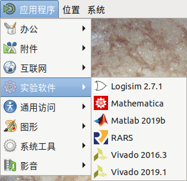

# RISC-V 工具链

Vlab 为虚拟机提供了 RISC-V 的 GCC 工具链和 [RARS 模拟器][rars]。

  [rars]: https://github.com/TheThirdOne/rars

## 使用 GCC 工具链

工具链位于 `/opt/vlab/riscv`，可以通过命令行直接使用，例如：

```shell
/opt/vlab/riscv/bin/riscv32-unknown-elf-gcc main.c -o main
```

!!! question "找不到 /opt/vlab"

    若你的虚拟机里没有 `/opt/vlab`，请联系我们以获得支持。

## 使用 RARS

RARS 可以从桌面左上角的应用程序菜单中打开。


