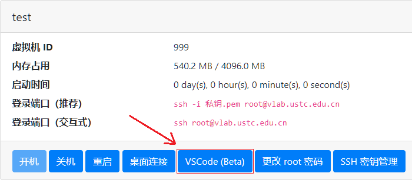
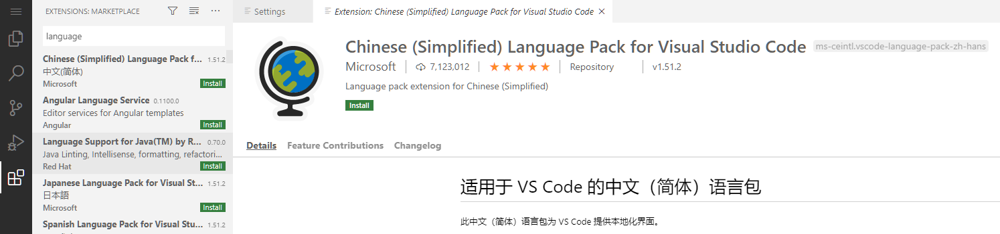

# 在线 Visual Studio Code

Vlab 提供了可以直接在浏览器里使用的 Visual Studio Code。

## 启用 VSCode 服务 {#enable-server}

在使用前需要在你的虚拟机里激活 VSCode 的服务端程序。

打开终端，输入 `vscode start` 即可，同时这会将 VSCode 服务设为开机自动启动，使得你下次可以直接使用 VSCode 而无需重新操作命令行。

!!! question "找不到命令 vscode"

    若提示找不到 `vscode` 命令，请尝试使用完整路径 `/opt/vlab/bin/vscode`。
    
    若完整路径也不存在，或你的虚拟机里没有 `/opt/vlab`，请联系我们以获得支持。

若你想要停止 VSCode 服务，请使用 `vscode stop`，同时这会取消 VSCode 服务的开机自动启动。

其他命令：

- `vscode restart` 可以重启 VSCode 服务，但不会改变它的开机自启状态
- `vscode disable` 将完全删除 VSCode 服务。你在使用过程中产生的数据将会保留。

!!! warning "如果正在使用无桌面的镜像"

    此时可能会发现，断开 SSH 连接后 VSCode 服务也会关闭。该问题与 Systemd 处理用户服务的方式有关，解决方法为在 root 用户下执行：

    ```
    loginctl enable-linger 用户名
    ```

    以设置在 session 全部关闭的情况下仍然保留用户服务。

## 使用 VSCode {#usage}

在启用 VSCode 服务后，在虚拟机管理页面点击对应虚拟机的 **VSCode** 按钮即可跳转进入使用，如图所示：



## 修改显示语言 {#change-language}

VSCode 默认语言为英语，若要使用中文语言，请在左侧扩展市场（Extension Market）搜索 Language，并安装中文语言包（ID 为 `ms-ceintl.vscode-language-pack-zh-hans`）

{: .img-border}

然后，打开终端，向 `~/.config/Code/User/locale.json` 中写入 `{"locale":"zh-cn"}`，如图所示：

{: .img-border}

刷新浏览器即可看到 VSCode 已切换至中文。

若要换回英语，删除刚才创建的 `locale.json` 文件，再刷新即可。
