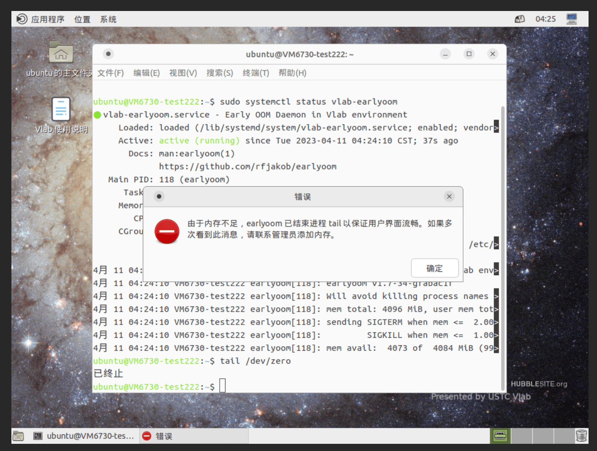

# 常见问题

## 连接问题 {#connection}

虚拟机无法连接

:   请检查以下项目：

    - 虚拟机是否已开机？（新创建的虚拟机初始状态为关机状态）
    - 虚拟机创建时是否选择了带有桌面环境的镜像？（01~09 号镜像都带有桌面环境）

    下面的问题只会在使用 VNC 客户端登录时遇到：

    - 你所在的网络可能屏蔽了 5900 端口（VNC 协议的标准端口），请尝试使用 449 端口，即在服务器地址处填入 `vlab.ustc.edu.cn:449`。如果很不幸两个端口都被屏蔽了，请使用浏览器登录。

虚拟机连接时提示密码错误

:   远程桌面连接方式使用 [Vlab 平台的登录密码](web.md#change-password)，而不是虚拟机内的密码。

使用网络信息中心的 Web VPN 访问桌面登录页面 noVNC 时显示 noVNC encountered an error

:   报错信息如下：

    !!! bug ""

        SyntaxError: import declarations may only appear at top level of a module

    请直接访问 [vlab.ustc.edu.cn](https://vlab.ustc.edu.cn/)，网页版桌面登录不兼容 Web VPN。

希望关闭/重新打开 VNC 连接时显示的通知

:   [Vlab VNC 通知设置页](https://vlab.ustc.edu.cn/vm/notif) 可以设置是否显示 VNC 通知。关闭前请务必加入我们的聊天群组，以及时获取通知。

SSH 连接提示 `sign_and_send_pubkey: no mutual signature supported`

:   该错误主要在 OpenSSH 8.8 及以上的客户端中出现，原因是 OpenSSH 8.8 默认取消了使用 RSA 公钥连接时的 `ssh-rsa` 签名算法。

    !!! info "该问题已于 2022-08-08 完整修复"

        目前 SSH 网关程序已支持更新的 RSA 签名算法。用户无需进行以下操作。

    在收到反馈后，我们已更新 01 号镜像。<del>若你的虚拟机编号大于 2267，那么你不需要进行处理。</del>

    请编辑 `$HOME/.ssh/config` 文件（Windows 用户请编辑 `%UserProfile%\.ssh\config`），添加以下内容恢复 OpenSSH 的选项：

    ```text
    Host *
        PubkeyAcceptedKeyTypes +ssh-rsa
    ```

Ubuntu 18.04 更新软件包后无法连接桌面

:   ~~目前确认我们推送的 vlab-vnc 剪贴板相关更新会导致 VNC 启动失败~~。最新版本的 vlab-vnc 包已经对 Ubuntu 18.04 的情况特殊处理，更新即可。

    需要编辑 `/etc/vlab/vncserver-lightdm` 文件，将 Xvnc 对应行中 SendPrimary 参数删去，保存文件后等待片刻即可重新连接。

    Ubuntu 18.04 即将在 2023 年结束支持，我们建议仍在使用 Ubuntu 18.04 用户备份数据后创建更新版本 Ubuntu 的虚拟机。

在运行需要大量使用内存的程序后无法连接

:   此时可尝试关机（重启失败的概率较大），然后重新开启虚拟机。如果需要更多的内存，请参考[额外功能](advanced/resources.md)联系 Vlab 管理员。

    此外，在最新的 22.04 的镜像中，我们包含了经过配置的 `earlyoom` 包，可以在系统内存不足时自动杀死占用内存较多的进程，并且在允许的情况下在终端和桌面上显示提示，预计可以有效地缓解此类问题。使用基于较早的镜像的虚拟机的用户可以安装 `vlab-earlyoom`：

    ```sh
    sudo apt update
    sudo apt install vlab-earlyoom
    ```

    !!! warning "Ubuntu 22.04 镜像的更新提示"

        我们发现之前发布的 22.04 的镜像中 `earlyoom` 的通知配置不正确，并于 2023-04-10 修复。对于在该日期及之前创建虚拟机的用户，需要升级以修复：

        ```sh
        sudo apt update
        sudo apt install --only-upgrade vlab-earlyoom  # 或者执行 apt full-upgrade 进行完整升级
        ```

        在更新后，界面显示效果类似如下：

        

## 软件问题 {#software}

### Vivado 仿真报错 {#s-vivado-xsim-error}

表现症状

:   尝试使用 Vivado 仿真时很快出现以下错误信息：

    ```text
    ERROR: [XSIM 43-3409] Failed to compile generated C file xsim.dir/test_behav/obj/xsim_1.c.
    ```

解决方法

:   打开终端，按顺序输入如下两条命令

    ```shell
    sudo apt update
    sudo apt install build-essential libncurses5
    ```

!!! info "新虚拟机不会出现此问题"

    在收到反馈后，我们已更新 01 号镜像。若你的虚拟机编号大于 2267，那么你不需要进行处理。

### 在线 VSCode 启动出现「只读变量」错误 {#s-vscode-read-only-variable}

表现症状

:   在终端中执行 `vscode` 时提示以下错误信息：

    ```text
    /opt/vlab/bin/vscode: 行 4: UID：只读变量
    ```

解决方法

:    打开终端，输入 `sudo dpkg-reconfigure dash`。在弹出的 "Use dash as the default system shell (/bin/sh)?" 中选择 Yes。

### `ping` 命令无法在普通用户下使用 {#s-ping-permission-denied}

表现症状

:   在终端中执行 `ping` 命令时提示以下错误信息：

    ```text
    ping: icmp open socket: Operation not permitted
    ```

解决方法

:   打开终端，输入 `sudo setcap cap_net_raw+ep /bin/ping`。

!!! info "新虚拟机不会出现此问题"

    在收到反馈后，我们已更新 01 号镜像。新创建的虚拟机不会出现此问题。

## 软件限制 {#limits}

由于技术更迭：

- 较早的虚拟机（编号在大约 1800 以前）默认未开启 Docker 容器支持；
- 2023 年 6 月 14 日前创建的虚拟机默认未开启 FUSE 支持。

如果有需要，请联系我们开通。

关于开启额外功能的详情请参见[额外功能](advanced/resources.md)。

### 需要挂载镜像至回环设备 (loop)

由于技术限制，我们无法在保证安全的前提下实现回环设备的共享。请根据文件系统的不同，考虑使用 FUSE 方案，或者使用基于 libguestfs 的 guestfish 进行文件操作。

??? tip "一个使用 guestfish 的参考例子"

    ```sh
    # 安装下面的操作需要的软件包
    $ sudo apt install --no-install-recommends libguestfs-tools

    # guestfish 依赖于在虚拟机中运行 Linux 内核来实现文件系统支持，因此需要安装内核（即使容器本体根本用不到）
    # 如果希望使用 KVM 加速 guestfish（需要 root），请查看下面一节。
    $ sudo apt install --no-install-recommends linux-image-generic
    
    # 可以使用 guestfish 创建一个 1G 的空白磁盘，并格式化为 GPT 分区表，创建一个分区，在 guestfish 中挂载为 /dev/sda1
    # $ guestfish -N disk.img=fs:ext4:1G:gpt -m /dev/sda1
    # 当然，这里我们展示更加传统的方案……
    $ truncate -s 1G disk.img
    $ parted disk.img mklabel gpt mkpart primary 0% 100%
    # 使用 guestfish 挂载磁盘
    $ guestfish -a disk.img

    Welcome to guestfish, the guest filesystem shell for
    editing virtual machine filesystems and disk images.

    Type: ‘help’ for help on commands
        ‘man’ to read the manual
        ‘quit’ to quit the shell

    ><fs> run
    ><fs> list-partitions
    /dev/sda1
    ><fs> mke2fs /dev/sda1 fstype:ext4
    ><fs> list-filesystems
    /dev/sda1: ext4
    ><fs> mount /dev/sda1 /
    ><fs> ls /
    lost+found
    ><fs> touch /hello
    ><fs> upload /etc/os-release /testfile
    ><fs> cat /testfile
    PRETTY_NAME="Debian GNU/Linux 11 (bullseye)"
    NAME="Debian GNU/Linux"
    VERSION_ID="11"
    VERSION="11 (bullseye)"
    VERSION_CODENAME=bullseye
    ID=debian
    HOME_URL="https://www.debian.org/"
    SUPPORT_URL="https://www.debian.org/support"
    BUG_REPORT_URL="https://bugs.debian.org/"
    ><fs> download /testfile ./testfile2
    ><fs> exit
    $ cat testfile2
    # 输出省略
    ```

### 使用 KVM 和 TUN 设备 {#kvm-and-tun}

如果需要使用 `/dev/kvm` 或 `/dev/net/tun`，在启动后手动执行以下命令：

```sh
sudo /opt/vlab/.dev/enable-dev.sh
```

该命令会创建所需的设备文件，但默认情况下 `/dev/kvm` 仅限 root 用户可以访问。例如，如果需要使用 KVM 加速的 QEMU（例如操作系统实验），可以使用以下命令：

```sh
# 安装 qemu-system-x86
sudo apt install qemu-system-x86
# 创建磁盘等配置
# ...
# 执行 KVM 加速的 QEMU，需要 root 权限
sudo qemu-system-x86_64 -cpu host -enable-kvm ...
```

若要在普通用户下使用 KVM 加速的 QEMU，可以将普通用户加入 `kvm` 用户组（GID = 107）中。对于 Ubuntu 系统，可以使用 `usermod -aG kvm <username>` 命令。

### 在进行操作系统实验时无法使用 `mknod` 新建设备文件 {#s-mknod-permission-denied}

需使用 `fakeroot`，详情可参考 [2020 年 OSH 实验讲义](https://osh-2020.github.io/lab-1/initrd/#fakeroot-initrd)。

## 虚拟机镜像选择 {#image-selection}

请参考 [虚拟机镜像](advanced/images.md) 一页。

## 故障排除 {#troubleshooting}

如果你的虚拟机出现问题，你可以[通过 SSH 命令行以恢复模式登录虚拟机](login/ssh.md#recovery)尝试进行错误排除。

## 系统大版本升级 {#dist-upgrade}

我们不建议在 LXC 虚拟机（容器）中执行大版本升级操作（如从 20.04 升级至 22.04），如果真的需要升级，请注意：

- 确保自己能够登录到恢复模式 SSH 中；
- 请在 SSH 命令行中完成升级。在图形界面中升级可能导致升级中断，带来问题。

### Ubuntu 22.04

如果在图形界面中从 20.04 升级至 22.04 后无法启动，请执行以下操作：

1. 登录恢复模式 SSH，删除 `/etc/acpi/events` 下的所有文件；
2. 重启；
3. 重启后 SSH 登录系统，运行 `apt upgrade` 完成剩下的升级操作。
