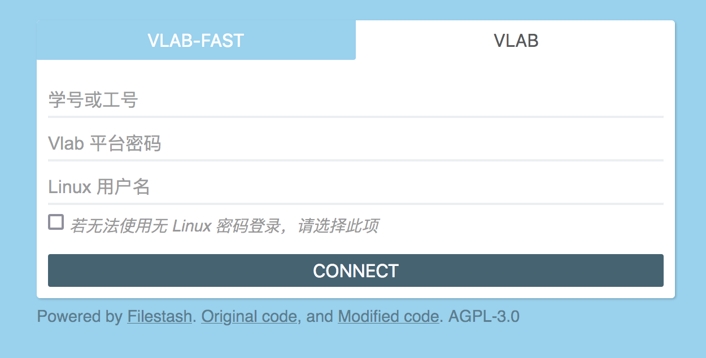

# 使用浏览器进行文件传输

Vlab 支持虚拟机与本机之间的文件传输，在首页上可以看到有「文件传输」选项：

同时也可以在「虚拟机管理」界面里找到入口：

## 登录

新版浏览器文件传输登录时不再需要输入学号、vlab 平台密码、Linux 用户名以及 Linux 密码。

如果已经登录管理页面，可以直接进行快速登录。

对于大部分用户，直接点击「连接」（CONNECT）即可登录。
若你有多个虚拟机，需要额外输入虚拟机 ID；若你的 Linux 用户名不为 ubuntu，需要额外输入登录的用户名。
默认情况下可以不输入 Linux 密码登录，如果此方法无法登录，可以勾选对应选项输入 Linux 密码。

如果未登录管理页面，可以选择使用传统登录方式：

如果使用新版文件管理无法登录，请联系我们。

## 文件管理器操作

文件管理器提供新建文件、新建文件夹、更改目录、修改文件名、删除文件、快速访问、文件上传、文件下载、文件编辑等功能：

## 文件上传与文件下载

文件上传支持的最大大小为 1024 MB (1 GB)。直接将本机的文件拖拽到网页端文件管理器即能将文件上传到对应目录：

当需要下载文件到本机时，点击需要下载的文件，进入文件的编辑页面，点击右上角的「下载」图标完成文件下载：

## 文件编辑

对于文本文件，在网页端文件管理器点击需要编辑的文件，可进入网页端编辑器进行编辑并保存：

!!! note "在线文件编辑的大小限制"

    若文件大小大于 16 MiB，则会直接显示下载选项。
