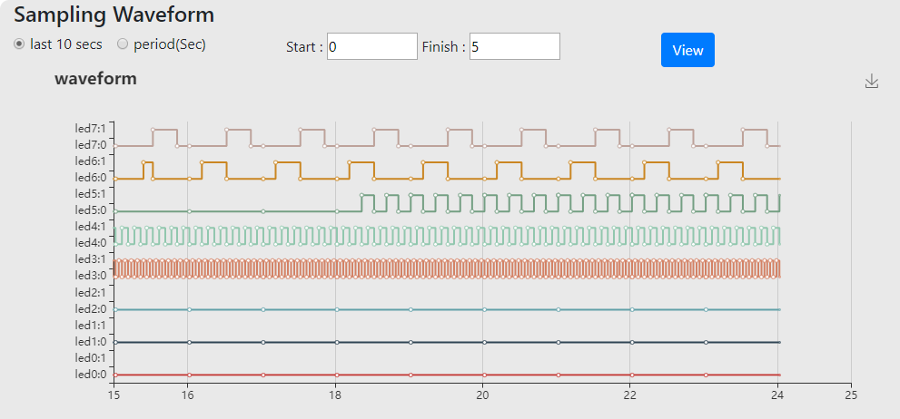

# FPGAOL 使用说明

## 编写 FPGA 工程

编写能在 **FPGA 在线**上使用的 FPGA 工程的过程和通常过程基本一样，只需注意 FPGA 芯片的选型和管脚的约束。

如果你还不会使用Vivado工具，可以参考Vivado使用指南。
强烈建议使用示例工程和约束文件开发。

### FPGA芯片型号

请务必选择**xc7a100tcsg324-1**，选择其他的型号会无法工作。

### 人体学接口引脚

发光二极管（LED）和拨动开关（Switch）的对应引脚：

| LED0 | LED1 | LED2 | LED3 | LED4 | LED5 | LED6 | LED7 |
| ---- | ---- | ---- | ---- | ---- | ---- | ---- |----|
| JC1 | JC2 | JC3 | JC4 | JC7 | JC8 | JC9 | JC10 |

| SW0 | SW1 | SW2 | SW3 | SW4 | SW5 | SW6 | SW7 |
| ---- | ---- | ---- | ---- | ---- | ---- | ---- |----|
| JD1 | JD2 | JD3 | JD4 | JD7 | JD8 | JD9 | JD10 |

### 开发板上的资源

* 100MHz 时钟：E3

## 在FPGA在线上试验你的设计

### 登录 & 获取资源

可以使用用户名和密码登录，也可以使用统一身份认证登录。

成功登录后，点击**获取**获取一个FPGA实例。

成功获取FPGA实例后，你可以在开发页面上试验你的设计。

### 上传和烧录

点击**选择文件**选择要上传的比特流文件。

### 使用人体学接口

在比特流文件成功上传并烧录后，就可以使用LED和拨动开关来测试你的设计。具体的行为取决于你的设计。

### 使用波形图

FPGA在线提供了基于采用的波形图帮助调试和测试。

你可以选择**最近一段时间**或者**特定一段时间**的波形图显示。
