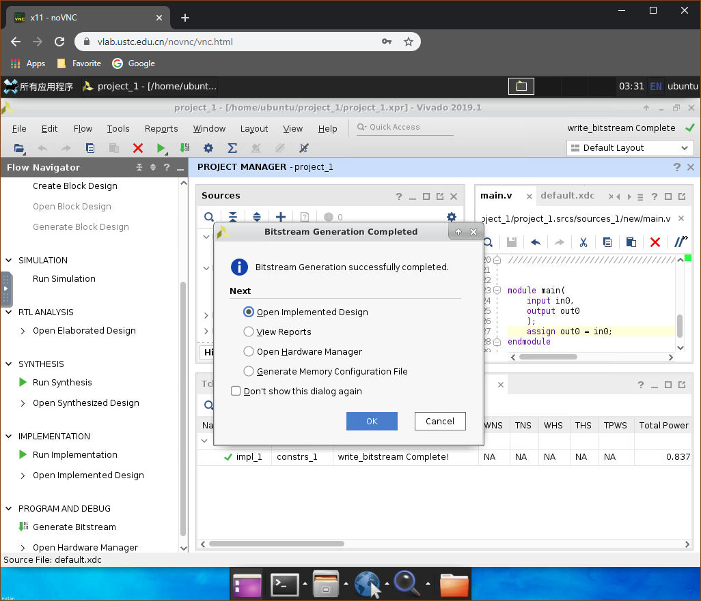

# 远程教学云桌面

!!! success "开始使用"

    请在左侧目录查找你想要了解的内容。不妨先从[快速开始](quickstart.md)进入使用吧！

远程教学云桌面项目（Vlab 项目）是由科大计算机实验教学中心提供的、基于互联网的 7x24 远程进行硬件、系统和软件教学实验平台，可校外登录使用，支持 SSH、浏览器和 VNC 远程桌面方式使用。

!!! note "讨论与通知"

    如果你对本平台有任何疑问，欢迎加入 QQ 群 <del>881039466</del>（一群，已满）1004525117（二群）讨论或邮件联系 vlab:fontawesome-solid-at:ustc.edu.cn。

    我们会通过 QQ 群公告和 [GitHub Issue](https://github.com/USTC-vlab/notifications) 的方式发布有关平台动态的通知，你也可以在这里[查看所有的通知公告](announcements.md)。**我们建议你至少关注一个通知渠道，以免错过平台更新或维护通知**。

本平台通过虚拟机的方式进行软件和系统方面的实验，基于 Linux 容器的方式使得线上体验和线下机房一致，还能够远程操作已部署好的 FPGA 集群进行硬件实验。

平台集群基于 Linux 容器搭建，计算与存储分离，提供给学生 7x24 小时使用。架构方面和 Linux 容器部署使用方面的稳定性已经经过计算机行业多年验证，系统架构的瓶颈仅受限于网络带宽。

!!! success "欢迎对我们致谢说明"

    如果 Vlab 帮助你完成了你的项目，我们将会非常开心地看到你在论文或报告中对 Vlab 致谢。

    参考模板：

    > 本项目得到了中国科学技术大学 Vlab 实验平台的帮助与支持。

    > This project is accomplished with the help of Vlab Platform of University of Science and Technology of China.
