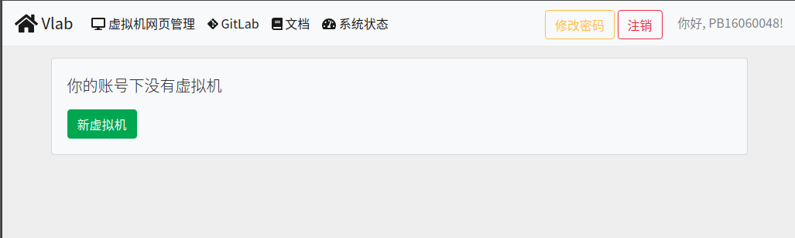
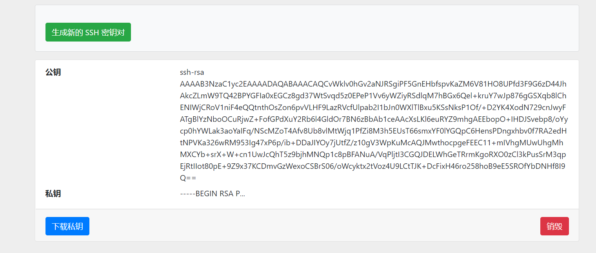
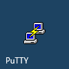
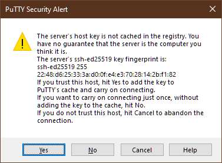
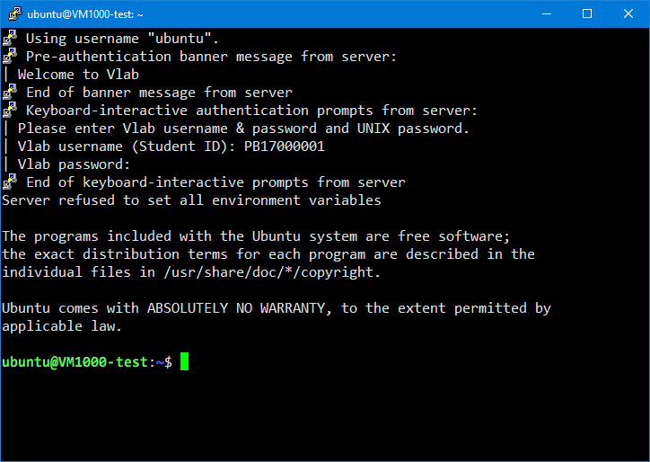
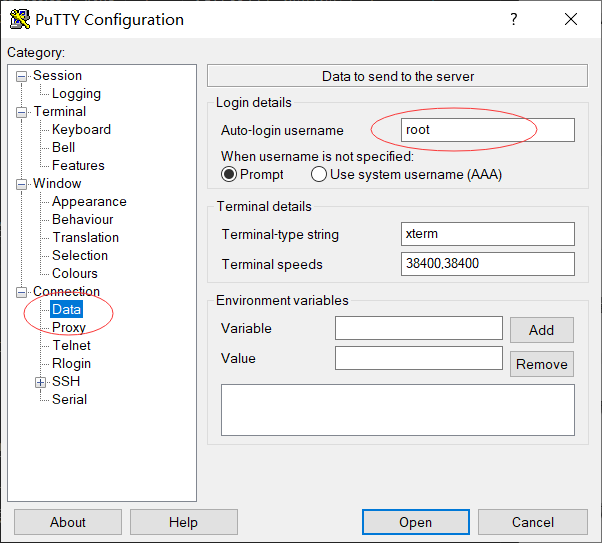

# 通过 SSH 命令行登录虚拟机

!!! example "支持的虚拟机和客户端"

    SSH 登录方式支持 Linux LXC 虚拟机和 Linux KVM 虚拟机。

    SSH 登录方式支持包括 Windows, macOS, Linux, iOS 和 Android 在内的客户端系统。

## 从命令行登录 {#cli}

=== ":fontawesome-brands-apple: macOS 和 :fontawesome-brands-linux: Linux"

    macOS 自带命令行 SSH 客户端，同时绝大多数的 Linux 发行版也自带了 SSH 客户端。若你的 Linux 系统中没有 SSH 客户端（`ssh` 命令），请自行搜索资料安装，软件包的名称通常为 `ssh`、`openssh` 或 `openssh-client` 之一。

    取决于你所选择的[虚拟机镜像](../advanced/images.md)，SSH 的登录用户名可能为 root、ubuntu 或 vlab，或者你自己创建的用户名。打开操作系统提供的终端应用，输入命令（以 ubuntu 用户为例）：

    ```shell
    ssh ubuntu@vlab.ustc.edu.cn
    ```

    如果遇到 Warning，请输入 `yes`，然后根据提示输入 Vlab 平台的用户名和密码，即可登录虚拟机。出于安全考虑，输入密码的时候没有回显。

    

=== ":fontawesome-brands-windows: Windows"

    Windows 10 可以在系统设置中启用 OpenSSH 客户端，请参考[微软的说明文档](https://docs.microsoft.com/zh-cn/windows-server/administration/openssh/openssh_install_firstuse)安装。

    同时 Windows 平台也有各种 Linux / Unix 环境模拟软件，例如

    - [Git Bash](https://gitforwindows.org/) ([MSYS2](https://www.msys2.org/))
    - [Cygwin](https://www.cygwin.com/)
    - [Windows Subsystem for Linux](https://docs.microsoft.com/zh-cn/windows/wsl/install-win10)

    你可以安装上述软件中的任何一种，然后参考“macOS 和 Linux”的使用说明。我们推荐使用 Git Bash 或者 WSL。

=== ":fontawesome-brands-android: Android"

    Android 系统可以从 [Google Play](https://play.google.com/store/apps/details?id=com.termux) 或者 [F-Droid](https://f-droid.org/en/packages/com.termux/) 获取 Termux 应用程序，然后使用 `pkg install ssh` 命令安装 SSH 客户端，然后参考“macOS 和 Linux”的使用说明。

!!! question "拥有多个虚拟机？"

    如果你拥有多个虚拟机，我们建议[使用公钥登录](#pubkey)。

    除了公钥登录之外，你也可以提示 Vlab username 时请输入 `学号:虚拟机编号` 的形式，例如 `PB17000000:1234`。

!!! question "用户名密码是什么？"

    `Vlab username` 是你的学号（或工号），在登录虚拟机管理页面后可以在右上角看到。

    `Vlab password` 是 Vlab 平台的登录密码。[还没设置？](../web.md#change-password)

### 使用公钥登录虚拟机 {#pubkey}

使用公钥登录虚拟机可以免除每次输入密码的麻烦。

#### 生成 SSH 密钥对并下载到本地 {#get-pubkey}

进入虚拟机管理界面，可以在自己虚拟机下方找到 SSH 密钥管理入口：


点击进入，即可通过点击 \[生成新的 SSH 密钥对\] 生成 SSH 密钥对：



此时公钥已经存储到 Vlab 平台上，只需要下载私钥并做一些配置就能利用密钥对进行免密登录。

点击 \[下载私钥\] 就能在下载文件中找到一个以 `.pem` 结尾的文件，这就是对应的 SSH 私钥。请妥善保管它，因为**任何获得这个文件的人都能够登录你的虚拟机**。

由于技术限制，每个虚拟机的私钥都是独立的。若你删除并重新创建了虚拟机，你需要重新生成密钥对才能使用密钥登录新的虚拟机。

将私钥移动至一个方便找到的地方，修改权限后即可用ssh登录。

Linux下操作：

例如私钥放在 `~/.ssh/vlab.pem`

```shell
chmod 600 ~/.ssh/vlab.pem
ssh -i ~/.ssh/vlab.pem ubuntu@vlab.ustc.edu.cn
```

Windows下操作：

例如私钥放在 `%HOMEPATH%/.ssh/vlab.pem`

Windows下修改权限需右击私钥文件，属性->安全，确保只有你一个账号有对私钥文件的权限。

修改权限后可直接用ssh登录：

```shell
ssh -i %HOMEPATH%/.ssh/vlab.pem ubuntu@vlab.ustc.edu.cn
```

!!! tip "使用公钥"

    与传统的 SSH 公钥不同，使用公钥登录 Vlab 平台时，用户名可以在 root、ubuntu 或 vlab 中任意选择。若你使用了其他用户名，则你还需要输入虚拟机内对应用户的密码。

## 使用 PuTTY 客户端登录 {#putty}

### 安装 PuTTY

=== ":fontawesome-brands-windows: Windows"

    首先[下载 PuTTY 客户端](https://www.chiark.greenend.org.uk/~sgtatham/putty/latest.html)，然后双击打开，安装过程很简单，直接 \[下一步\] 到底即可。安装完成后，找到并打开 PuTTY，如图：

    

    在 Host Name 一栏填入 `vlab.ustc.edu.cn`，端口号为 22（这是默认值），点击 **Open**，如图：

    

    第一次连接时会提示你选择信任 Vlab 统一登录平台，点 Yes 即可：

    

=== ":fontawesome-brands-linux: Linux"

    部分 Linux 发行版的软件源里提供了 PuTTY 软件，可以直接从软件源安装，例如：

    * Ubuntu 和 Debian：`sudo apt-get install putty`

    * CentOS, Fedora 和 RHEL：`sudo yum install putty`

    * Arch Linux 和 Manjaro：`sudo pacman -S putty`

    安装完成后请参考 Windows 的使用说明来使用和配置 PuTTY。

### 使用密码登录虚拟机 {#putty-password}

连接到统一登录平台后，PuTTY 会要求你输入用户名和密码。取决于你所选择的[虚拟机镜像](../advanced/images.md)，SSH 的登录用户名可能为 root、ubuntu 或 vlab，或者你自己创建的用户名。然后根据提示输入你的 Vlab 用户名和密码（输入的密码没有回显），按回车即可：


登录成功后即可使用虚拟机，如图：



PuTTY 还有一些高级的使用方法，例如你可以保存这些连接信息，以后可以更方便地连接虚拟机。这里有两篇不错的使用教程：

- <https://www.hostarr.com/putty-tutorial/>
- <https://www.cnblogs.com/yuwentao/archive/2013/01/06/2846953.html>

### 使用公钥登录虚拟机 {#putty-pubkey}

#### 将 .pem 格式的私钥转换为 .ppk 格式 {#pubkey-convert}

由于 PuTTY 使用的私钥格式为其专用的 `.ppk` 格式，而不是更为通用的 PEM 格式，所以我们还要进行一步转换。转换私钥格式需要用到 PuTTYgen，即 PuTTY 的密钥生成与转换工具。一般在安装 PuTTY 时已包含它，如果你安装的 PuTTY 中未包含这个工具，请在[这个页面](https://www.chiark.greenend.org.uk/~sgtatham/putty/latest.html)直接下载 `puttygen.exe`。

首先参考[使用公钥登录虚拟机](#pubkey)一节下载 PEM 格式的公钥文件。在开始菜单的 PuTTY 文件夹下，或者 PuTTY 的安装目录下就能找到 PuTTYgen，打开后可以看到如下界面：


点击 **Load** 找到刚刚下载的 `.pem` 文件打开，然后点击 **Save private key**，选择一个合适目录保存生成的 `.ppk` 文件。同样地，请妥善保管这个私钥文件。

#### 在 PuTTY 中设置私钥并保存会话信息 {#pubkey-save-session}

先到 Connection - Data 项设置自己的登录用户名（这里以 root 为例，你也可以使用 ubuntu 或 vlab，详情参见[镜像配置](../advanced/images.md#image-content)），如图：



再点 SSH 项下面的 Auth，添加上一步转换得到的 `.ppk` 格式的私钥：


然后最重要的是回到最上面的 Session 项里保存，不然下次又得重新添加一遍。你可以为这个配置取一个容易辨别的名字，例如 `vlab`。


保存后每次登录时只需要双击之前保存的连接信息，就能免密登录你的虚拟机。

## 使用其他客户端登录 {#others}

市面上还有诸如 XShell 和 Termius 等其他客户端，作为 SSH 客户端，它们的功能和使用方法大都相似，这里不再一一给出使用说明。

对于 Windows 操作系统，可以在这里下载 [XShell](https://www.netsarang.com/zh/free-for-home-school/) 或 [Termius](https://termius.com/windows)。请参考各软件的使用说明来配置登录。其中 Termius 还有 macOS、Linux、iOS 和 Android 等多个系统的版本，具体请在 [Termius 官网](https://termius.com/)上查看。
