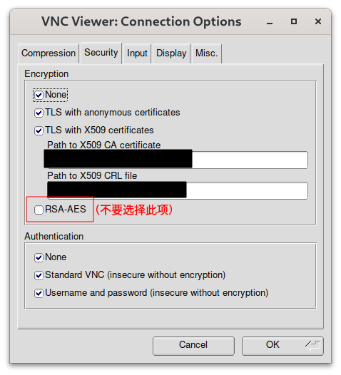

# 通过 VNC 远程桌面登录虚拟机

!!! example "支持的虚拟机和客户端"

    VNC 登录方式仅支持 Linux LXC 虚拟机，这也是 Vlab 提供的默认虚拟机类型。

    VNC 登录方式支持从[浏览器直接登录](browser.md)，也支持包括 Windows, macOS, Linux, iOS 和 Android 在内的客户端系统。

!!! info "注意"

    该登录方式只适用于名称中带有 `desktop` 的虚拟机镜像。

## 在浏览器中直接登录 {#browser}

请移步至[浏览器直接登录](browser.md)一页。

## 使用 TigerVNC 登录（推荐） {#tigervnc}

??? question "无法使用 TigerVNC 连接到虚拟机？"

    如果你无法使用 TigerVNC 连接到虚拟机，请在连接界面选择 "Options..."，在 Security 下取消选择 RSA-AES，如图所示：

    

    连接到 Vlab 的 VNC 流量会使用 TLS 加密，因此取消 RSA-AES 不会影响安全性。

??? tip "客户端下载"

    * Windows，macOS 和 Linux：[:fontawesome-brands-github: GitHub](https://github.com/TigerVNC/tigervnc/releases/latest)

    * Ubuntu 和 Debian：`sudo apt-get install tigervnc-viewer`

    * CentOS, Fedora 和 RHEL：`sudo yum install tigervnc`

    * Arch Linux 和 Manjaro：`sudo pacman -S tigervnc`

=== ":fontawesome-brands-windows: Windows"

    以 Windows 10 系统为例，[下载 TigerVNC 客户端](https://vlab.ustc.edu.cn/downloads/vncviewer64-1.11.0.exe)，如图：

    {: .img-border }

    在服务器地址处填入 `vlab.ustc.edu.cn`，并点击 **Connect**：

    

    这里提示要输入用户名和密码，输入学号（或工号）和网页平台的登录密码：

    

    登录后即可看到桌面并开始使用。

=== ":fontawesome-brands-apple: macOS"

    [下载 macOS 下的 TigerVNC 客户端](https://vlab.ustc.edu.cn/downloads/TigerVNC-1.11.0.dmg)并安装（与安装其他的应用一样，打开 dmg 文件并将应用拖动到 Application 目录即可）。

    打开 TigerVNC 客户端，如图所示输入 `vlab.ustc.edu.cn`，点击 `Connect`。

    

    这里提示要输入用户名和密码，输入学号（或工号）和网页平台的登录密码即可登录：

    

    登录后即可看到桌面并开始使用。

=== ":fontawesome-brands-linux: Linux"

    Linux 系统可以从 GitHub 下载通用型客户端（格式为 `.tar.gz`），也可以从各大发行版的软件源直接获取。

    * Ubuntu 和 Debian：`sudo apt-get install tigervnc-viewer`

    * CentOS 和 Fedora：`sudo yum install tigervnc`

    * Arch Linux 和 Manjaro：`sudo pacman -S tigervnc`

    其界面和操作与 macOS 相同，请参考 macOS 的使用说明。

=== ":fontawesome-brands-apple: iOS / :fontawesome-brands-android: Android"

    TigerVNC 没有 iOS 和 Android 的客户端，请移步至下方 [RealVNC](#realvnc) 的使用说明。

!!! question "拥有多个虚拟机？"

    如果你拥有多个虚拟机，登录时请输入 `学号:虚拟机编号` 的形式，例如 `PB17000000:1234`。

!!! question "密码是什么？"

    VNC 登录方式使用 Vlab 平台的登录密码。[还没设置？](../web.md#change-password)

## 使用 RealVNC 客户端登录 {#realvnc}

??? tip "客户端下载"

    在 [RealVNC 官网][realvnc-all]选择你的系统平台，点击 **Download VNC Viewer** 即可下载，如图：

    {: .img-border }

    另外，iOS 设备可以从 [:fontawesome-brands-app-store-ios: App Store][realvnc-ios] 获取 VNC Viewer，Android 设备可以从 [:fontawesome-brands-google-play: Google Play][realvnc-android] 或其他应用商店获取 VNC Viewer。

  [realvnc-all]: https://www.realvnc.com/en/connect/download/viewer/
  [realvnc-ios]: https://apps.apple.com/us/app/vnc-viewer-remote-desktop/id352019548
  [realvnc-android]: https://play.google.com/store/apps/details?id=com.realvnc.viewer.android

=== ":fontawesome-brands-windows: Windows"

    以 Windows 10 系统为例，[下载 RealVNC 客户端](https://www.realvnc.com/en/connect/download/viewer/windows/)并安装。安装好后在开始菜单中找到 RealVNC 的图标，如下图所示：

    

    打开后的主界面如图所示，在地址栏输入 `vlab.ustc.edu.cn`，按回车连接：

    

    与 TigerVNC 相同，输入学号（或工号）和网页平台的登录密码即可登录：

    

=== ":fontawesome-brands-apple: macOS"

    下载 macOS 下的 [RealVNC 客户端](https://www.realvnc.com/en/connect/download/viewer/macos/)并安装（与安装其他的应用一样，打开 dmg 文件并将应用拖动到 Application 目录即可）。

    打开 VNC Viewer，打开后的主界面如图所示，在地址栏输入 `vlab.ustc.edu.cn`，按回车连接：

    

    如果出现以下画面，选择 **Continue**。

    

    与 TigerVNC 相同，输入学号（或工号）和网页平台的登录密码即可登录：

    

=== ":fontawesome-brands-linux: Linux"

    根据发行版的不同，选择 DEB，RPM 格式或 Standalone 版的 [RealVNC 客户端](https://www.realvnc.com/en/connect/download/viewer/linux/)，并使用操作系统的包管理器安装（Standalone 版不需要安装）。

    Linux 客户端的界面和操作与 macOS 相同，请参考 macOS 的使用说明。

=== ":fontawesome-brands-apple: iOS / :fontawesome-brands-android: Android"

    从 [:fontawesome-brands-app-store-ios: App Store][realvnc-ios]、[:fontawesome-brands-google-play: Google Play][realvnc-android] 或其他应用商店获取 VNC Viewer。

    打开 VNC Viewer 应用，添加服务器，在 Address 处输入 `vlab.ustc.edu.cn`，并填写一个可以辨认的名称（如 Vlab），然后点击刚刚新建的项目即可连接。

    登录信息和提示等请参考 macOS 的使用说明。

## 桌面设置 {#desktop-settings}

### 修改分辨率 {#change-resolution}

!!! tip "提示"

    更高的分辨率需要更快的网速，若网速不够，VNC 会自动降低显示质量（分辨率不变，颜色深度降低），可能会影响显示效果。建议根据自己的使用环境选择合适的分辨率。

    默认的桌面分辨率为 1024×768，适合大多数人使用。

!!! tip "提示"

    TigerVNC 客户端默认会根据窗口大小自动修改分辨率。
    
    使用网页登录的用户可以选择 noVNC 左侧齿轮，设置 Scaling Mode 为 Remote Resizing 以启动自动调整分辨率的功能；另一个 Local Scaling 选项仅会直接拉伸显示，不会自动调整分辨率。

    

对于 Ubuntu 18.04 Xfce4 老镜像，如果你需要修改分辨率，可以在左上角找到 **设置 → 显示**，如图：

对于 Ubuntu 20.04 及以上的 MATE 镜像，可以在菜单栏找到 **系统 → 硬件 → 显示器** 调整分辨率。调整分辨率后，如果托盘位置显示异常，请在对应位置点击右键，取消「锁定到面板」后再次右键，点击「移动」，将鼠标移动到最右侧后点击确认即可。

### 设置中文输入法 {#chinese-ime}

!!! success "虚拟机已默认启用中文输入法"

系统自带的输入法为 IBus，可以手动启用中文输入。在左上角找到 Applications → Settings → IBus Preferences 设置：

在 Input Method 选项卡点 Add，然后在 Chinese 里找到 Pinyin，再次点击右下角的 Add 即可：

添加成功后可以在右上角切换中文与英文输入法，也可以按 <kbd>Shift</kbd> 键在中文输入法中切换中英文输入。
