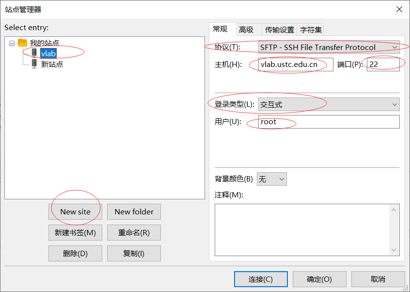
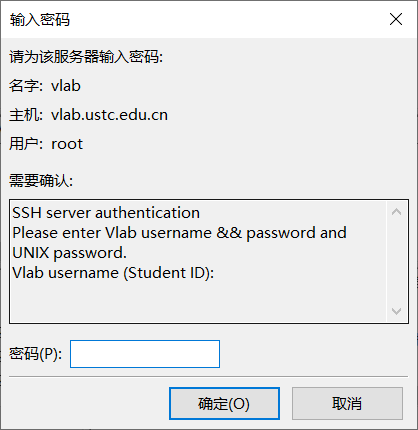
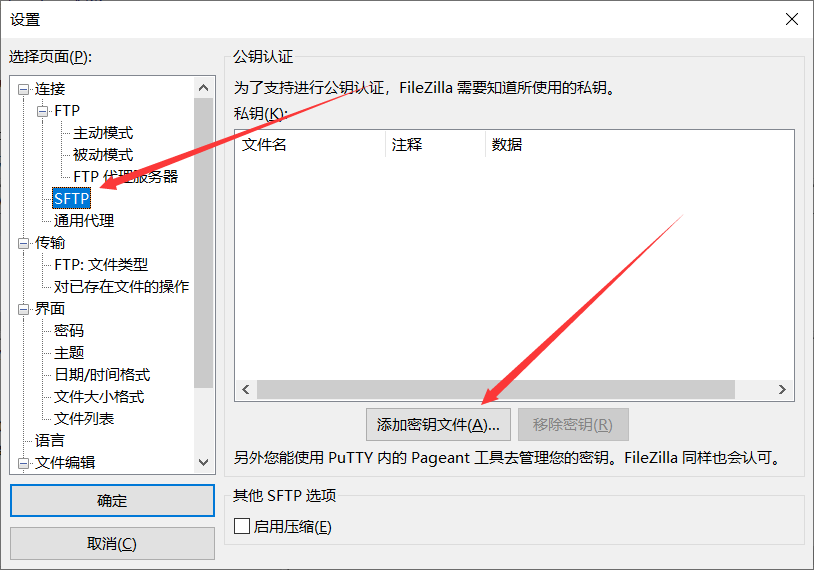
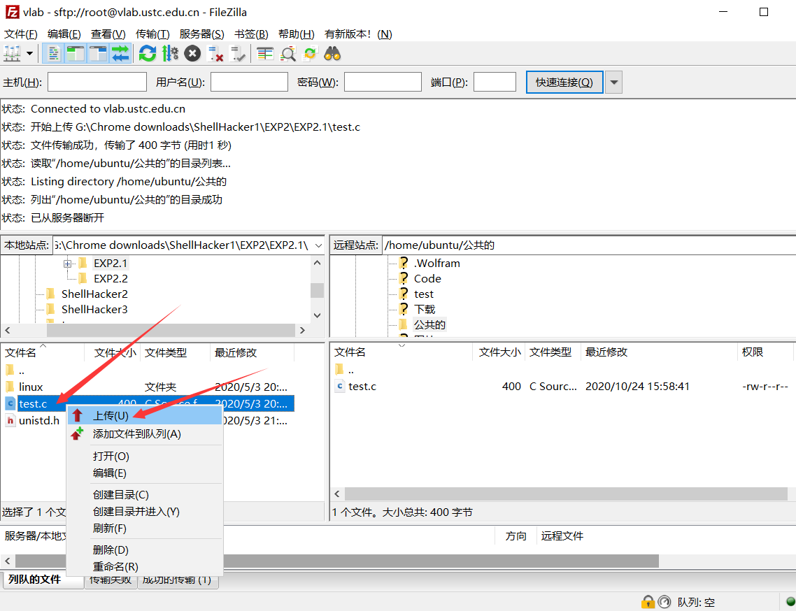

# 使用客户端软件进行文件传输

Vlab 支持使用 SFTP 客户端软件进行虚拟机与本机之间的文件传输。下面介绍 FileZilla 等常见软件的使用方式。

## FileZilla {#filezilla}

FileZilla 可以从其[官方网站](https://filezilla-project.org/download.php?show_all=1)获取，根据你使用的系统选择对应的下载版本，下载后的安装过程种一路点击 \[下一步\] 即可。

安装完成后找到并打开 FileZilla，可以看到如下界面：

### 交互式登录 {#filezilla-interactive}

首先新建一个 SFTP 配置，先进入站点管理器：

在站点管理器中点击 \[New site\] 新建一个站点，你可以为这个配置取一个容易辨别的名字，例如 `vlab`。然后是右边常规选项卡中的配置了：

- 协议选择 **SFTP**
- 主机为 **vlab.ustc.edu.cn**，端口为 **22**，如下图所示
- 登录类型选择**交互式**
- 用户可以填 **root**，也可以使用 **ubuntu** 或 **vlab**，详情参见[镜像配置](images.md#image-content)

点击 \[连接\] 按钮的话，将会立即连接该 SFTP 站点；点击 \[确定\] 按钮的话，则保存并关闭 \[站点管理器\] 窗口。

点击 \[连接\] 按钮后，会出现如下界面：

按照提示依次输入 `Vlab Username`, `Vlab password` 和 `UNIX password` 即可登录（注意：输入一项要点击一次确定）

然后可看到如下界面：

### 公钥认证登录 {#filezilla-pubkey}

除了使用交互式登录，你还可以将下载到的私钥配置到 FileZilla 实现公钥免密登录。如果你还没有下载私钥，请参考[生成 SSH 密钥对并下载到本地](login-windows.md#pubkey-retrieve)

首先打开设置：

然后找到 SFTP 并添加密钥文件：

点击 \[确定\] 后，再找到原来保存的站点连接，即可免密登录。

### 上传本地文件到虚拟机 {#filezilla-upload}

首先在【本地站点】（也就是本地电脑）中找到并选择你要上传到虚拟机的文件或文件夹。

然后在【远程站点】（也就是虚拟机）中找到并进入你要上传文件或文件夹到的目录（即目标目录）。

在要上传的文件或文件夹上点击右键，选择【上传】即可；也可以直接把要上传的内容拖拽到右边远程站点的目录下：

### 下载虚拟机文件到本地 {#filezilla-download}

下载虚拟机文件到本地和上传本地文件到虚拟机的操作类似，在右边远程站点选中你要下载的内容，右键点击 \[下载\] 即可，也可以直接拖拽到左边本地站点的目录下。

## WinSCP {#winscp}

TBD
