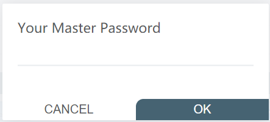

# 使用浏览器进行文件传输

Vlab 支持虚拟机与本机之间的文件传输，在 [vlab 主页](https://vlab.ustc.edu.cn/) 上可以看到有「文件传输」选项：

同时也可以在「虚拟机管理」界面里找到入口：

## 登录

登录需要输入学号、vlab 平台密码、Linux 用户名以及 Linux 密码：

如果勾选 **Remember me** 会弹出设置主密码的窗口，设置好后登录就只需要输入主密码：

## 文件管理器操作

文件管理器提供新建文件、新建文件夹、更改目录、修改文件名、删除文件、快速访问、文件上传、文件下载、文件编辑等功能：

## 文件上传与文件下载

直接将本机的文件拖拽到网页端文件管理器即能将文件上传到对应目录：

当需要下载文件到本机时，点击需要下载的文件，进入文件的编辑页面，点击右上角的「下载」图标完成文件下载：

## 文件编辑

对于文本文件，在网页端文件管理器点击需要编辑的文件，可进入网页端编辑器进行编辑并保存：

