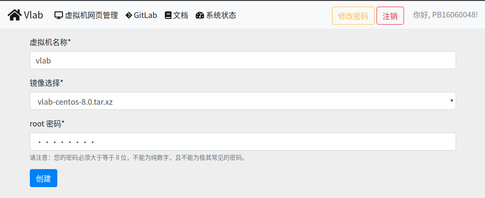
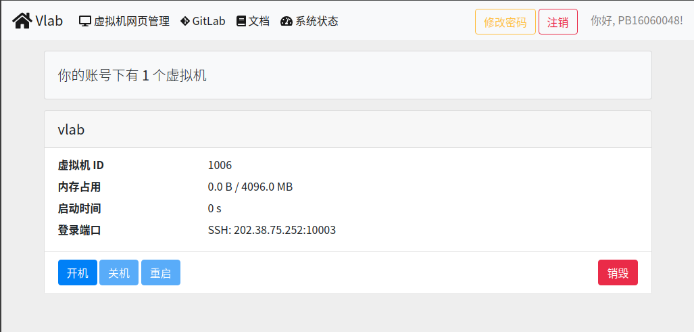

# Linux下ssh连接到虚拟机
## 新建虚拟机

1. 进入Vlab平台,新建虚拟机
   
2. 输入虚拟机名称,选择镜像,设置root密码
   
3. 点击开机即创建完成
   

## 安装ssh
* Ubuntu,debian 下: sudo apt-get install ssh
* centos,fedora,redhat 下: sudo yum install ssh-clients

## 登录
* 根据虚拟机登录IP地址和端口(下图例如地址为202.38.75.252,端口为10003),输入命令:
   > ssh root@202.38.75.252 -p 10003
* 依次输入"yes",和之前设置的root密码,即完成登录
   
