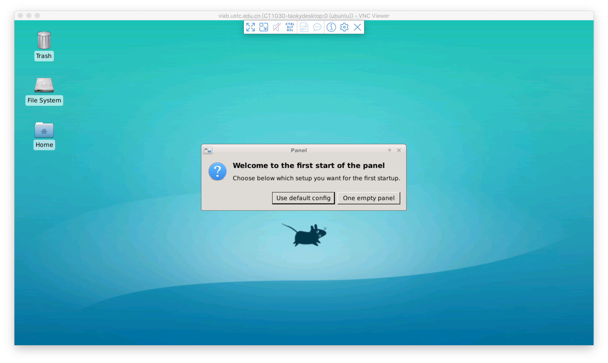

# macOS 系统登录虚拟机

## 命令行：使用 SSH 登录 {#ssh}

macOS 自带命令行 SSH 客户端。

### 登录 {#ssh-login}

* 根据虚拟机登录 IP 地址和端口（例如，下图中地址为 `202.38.75.252`，端口为 `10004`），输入命令：

    ```shell
    ssh -p 10004 root@202.38.75.252
    ```

    此命令也可以从你的管理页面找到。

* 如果遇到 Warning，请输入 `yes`，然后输入之前设置的 root 密码，即可登录虚拟机

    {: .img-center }

## 图形界面：使用 VNC 登录 {#vnc}

!!! info "注意"

    该登录方式只适用于名称中带有 `desktop` 的虚拟机镜像。

[下载 macOS 下的 RealVNC 客户端](https://www.realvnc.com/en/connect/download/viewer/macos/)并安装（与安装其他的应用一样，打开 dmg 文件并将应用拖动到 Application 目录即可）。

打开 VNC Viewer，打开后的主界面如图所示，在地址栏输入 `vlab.ustc.edu.cn`，按回车连接：

{: .img-center }

如果出现以下画面，continue 即可。


这里提示要输入用户名和密码，输入学号（或工号）和网页平台的登录密码即可登录：

{: .img-center }

!!! question "密码是什么？"

    VNC 登录方式使用 Vlab 平台的登录密码。[还没设置？](../#change-password)

登录后即可看到桌面。初次登录时会提示初始化配置，选择 `Default config` 即可：

{: .img-center }

## 桌面设置

关于一些常用的桌面设置，如

- 修改 VNC 分辨率
- 中文输入法

等，请参阅[桌面设置](../desktop-settings)页面。
