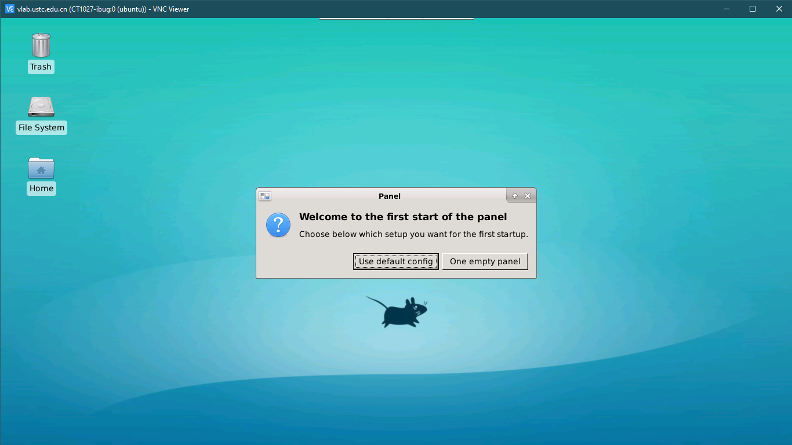

# Windows 系统登录虚拟机

## 命令行：使用 SSH 登录

Windows 需要安装 SSH 客户端，有各种选择：

- PuTTY ([官方下载](https://www.chiark.greenend.org.uk/~sgtatham/putty/latest.html))
- XShell ([NetSarang 官方下载](https://www.netsarang.com/zh/free-for-home-school/))
- Termius ([官方下载](https://termius.com/windows)，另有 [Windows 10 应用商店版](https://www.microsoft.com/store/productId/9NK1GDVPX09V))
- Git Bash (MSYS2) (请参考 [Linux 系统的登录方式](../login-linux/))
- Cygwin (请参考 [Linux 系统的登录方式](../login-linux/))

下面以免费开源的 PuTTY 为例在 Windows 上连接 Vlab 虚拟机。安装过程很简单，直接 \[下一步\] 到底即可。安装完成后，找到并打开 PuTTY，如图

### PuTTY 登录方式

{: .img-center }

在 Host name 一栏填入 `202.38.75.252`，端口号填写网页管理界面给出的端口号（在 `ssh -p` 后面的一个 10001 ~ 29999 之间的数字），点击连接，如图：

{: .img-center }

第一次连接时会提示你选择信任虚拟机，点 Yes 即可：

{: .img-center }

然后 PuTTY 会要求你输入用户名和密码，用户名输入 root，密码输入你在创建虚拟机时设定的 root 用户密码，按回车即可：

{: .img-center }

PuTTY 还有一些高级的使用方法，例如你可以保存这些连接信息，以后可以更方便地连接虚拟机。这里有两篇不错的使用教程：

- <https://www.hostarr.com/putty-tutorial/>
- <https://www.cnblogs.com/yuwentao/archive/2013/01/06/2846953.html>

## 图形界面：使用 VNC 登录

!!! info "注意"

    该登录方式只适用于名称中带有 `desktop` 的虚拟机镜像。

以 Windows 10 系统为例，[下载 RealVNC 客户端](https://www.realvnc.com/en/connect/download/viewer/windows/)并安装。安装好后在开始菜单中找到 RealVNC 的图标，如下图所示：

{: .img-center }

打开后的主界面如图所示，在地址栏输入 `vlab.ustc.edu.cn`，按回车连接：

{: .img-center }

这里提示要输入用户名和密码，输入学号（或工号）和网页平台的登录密码即可登录：

{: .img-center }

登录后即可看到桌面。初次登录时会提示初始化配置，选择 `Default config` 即可：

{: .img-center }

### 设置中文输入法

系统自带的输入法为 IBus，可以手动启用中文输入。在左上角找到 Applications → Settings → IBus Preferences 设置：

{: .img-center }

在 Input Method 选项卡点 Add，然后在 Chinese 里找到 Pinyin，再次点击右下角的 Add 即可：

{: .img-center }

添加成功后可以在右上角切换中文与英文输入法，也可以按 <kbd>Shift</kbd> 键在中文输入法中切换中英文输入。
