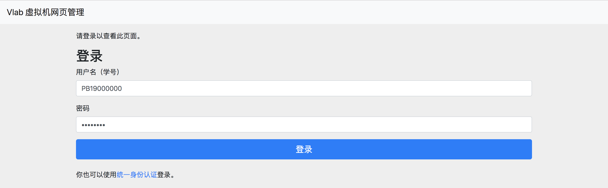
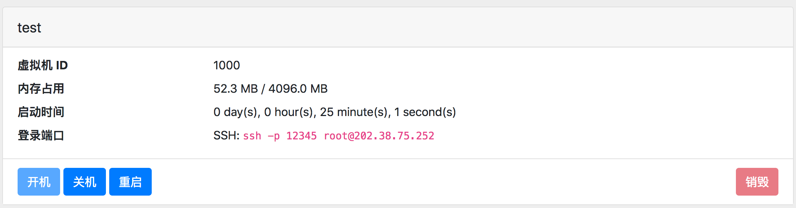

# 虚拟机管理控制台

虚拟机管理控制台是你管理虚拟机的地方。在这里你可以创建虚拟机、开关机和重启，以及查看远程连接信息。

## 登录 {#login}

在登录界面，可以使用你的学号登录，或者通过统一身份认证使用**学号**登录。

## 界面 {#interface}

登录后，你可以查看你账号下拥有的虚拟机。默认每个用户允许创建 1 个虚拟机。

### 设置登录密码 {#change-password}

虚拟机管理页面的右上角提供设置密码与退出登录的功能，如图：

{: .img-border }

该密码既用于登录平台管理页面（不使用统一身份认证的时候），也用于通过 VNC 方式登录虚拟机。

### 创建虚拟机 {#create-vm}

点击「新虚拟机」按钮，可以创建虚拟机。在创建页面中，需要输入虚拟机名称、选择镜像以及输入 root 密码。

其中：

- 虚拟机名称只能由英文字母、数字、短线 (`-`) 和点 (`.`) 构成
- 镜像选择中，只有含 `desktop` 的镜像包含桌面环境；不含 `desktop` 的镜像只能使用命令行登录，建议有 Linux 经验的同学选用

    !!! question "不知道选择哪个镜像？"

        你可以参考 FAQ 中的[“虚拟机镜像选择”章节](faq.md#image-selection)。

        对于大多数计算机系同学，我们推荐使用默认镜像（名称以 `vlab01` 开头）。

- 为了保证安全，您输入的 root 密码需要大于等于 8 位，不能为纯数字，且不能为极其常见的密码。

    !!! warning "注意"

        请牢记 root 密码，否则将无法通过命令行登录虚拟机。**VNC 登录方式不使用此密码**。

点击「创建」创建虚拟机，稍等片刻即可。

### 管理虚拟机 {#manage-vm}

下方的功能按钮分别为：

- 开机：启动虚拟机（如果虚拟机处于关闭状态）
- 关机：停止虚拟机运行
- 重启：重启虚拟机（请注意在停止/重启前保存你的状态）
- 桌面连接：跳转至浏览器 VNC 登录页面，见[浏览器登录](login-browser.md)页面。
- 更改 root 密码：如其所述
- 销毁：删除这个虚拟机。**注意这是不可逆的，所有数据都会被删除。**

!!! info ""

    注：「桌面连接」和「更改 root 密码」这两个按钮只在虚拟机开机时才会出现。

## 使用 SSH/VNC 登录虚拟机 {#login-vm}

使用统一身份认证登录的用户，初始密码为空，因此无法使用 VNC 登录，需要[设置平台登录密码](#change-password)后方可使用 VNC 登录虚拟机。

VNC 登录方式的具体操作请在左侧目录查阅各个操作系统的配置说明。

!!! info "提示"

    SSH 方式的登录用户为 root，密码为创建虚拟机时所设置的 root 密码。

    VNC 登录使用 Vlab 专有的服务，使用学号或工号与上面所述的平台密码登录。
