# 本地 VSCode 通过 Remote SSH 连接 Vlab

## 虚拟机 Vivado 新建工程和设计文件 {#vivado}

### 1. 新建工程

在虚拟机的桌面上，最上面**应用程序**中的 **Vlab 实验软件**里可找到预先安装的的 Vivado，点击进入 Vivado。这里请大家选择 2019.1 版本，不要选择 2016.3 的旧版本。2023.1 版本的 Vivado 虽然更便捷，但可能引起内存不足的警告，因此请大家酌情使用。

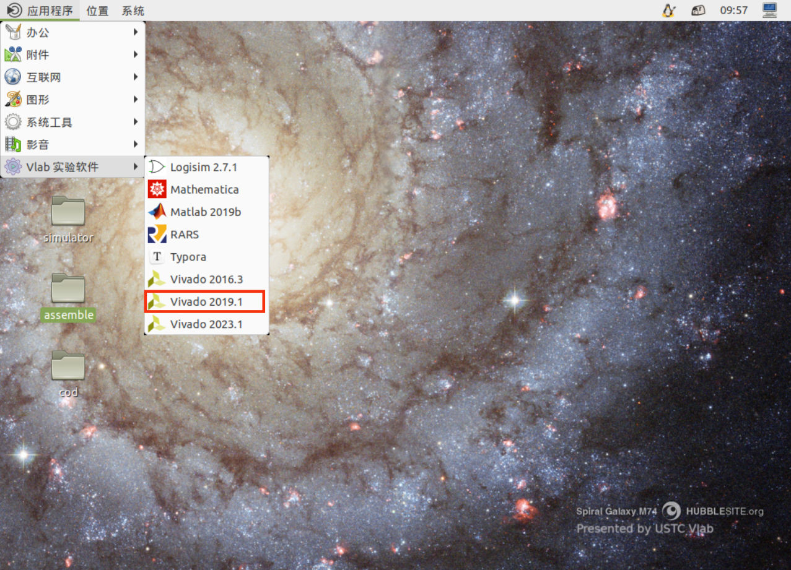

进入 Vivado 后，点击 Create Project:

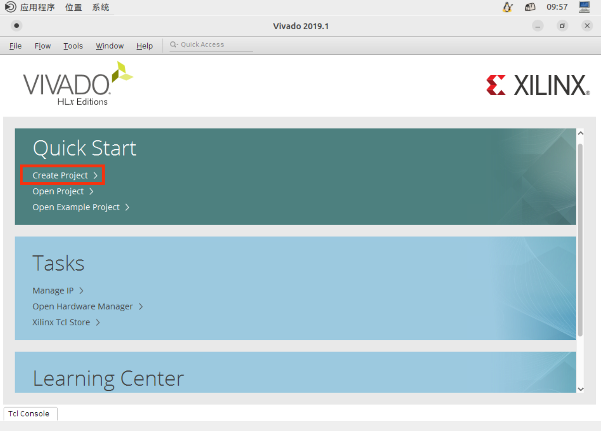

然后点击 Next:

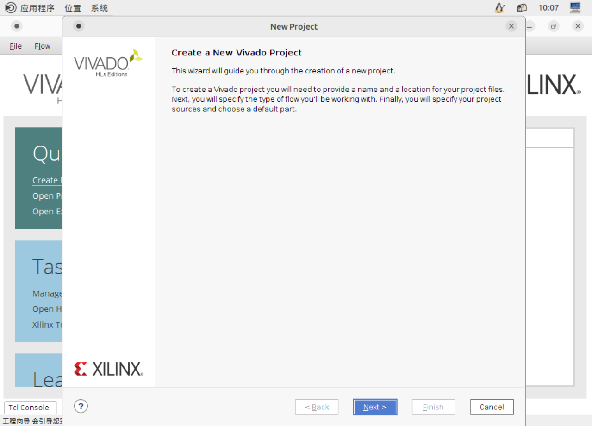

在这个界面，你可以设置工程文件的名称和路径：

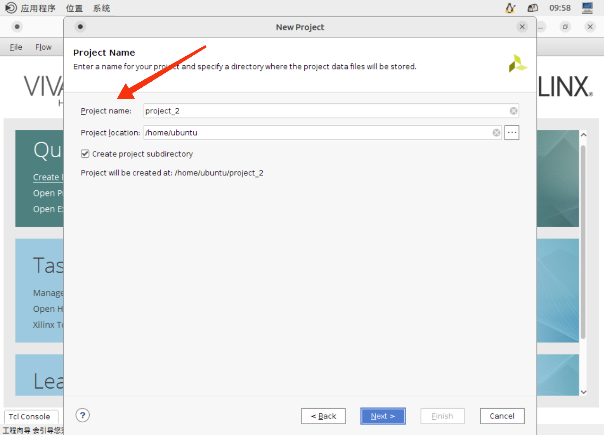

随后一路 Next，直到遇到“选择开发板型号”的界面。搜索我们使用的开发板，型号为 `xc7a100tcsg324-1`，点击选择最下面的开发板。

!!! info "注意"

    此型号是按照往年课程使用的开发板选择的。
    
    若课程安排有所调整，请以实际课程要求开发板型号为准。

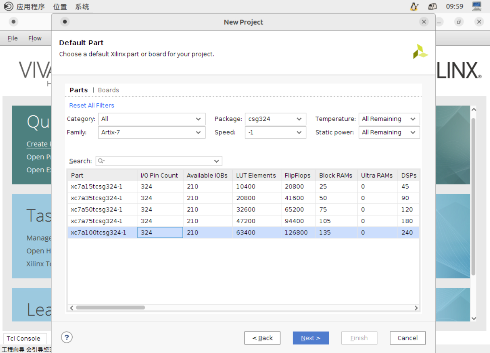

完成后，我们就成功新建了一个工程项目，可以看到如下界面：

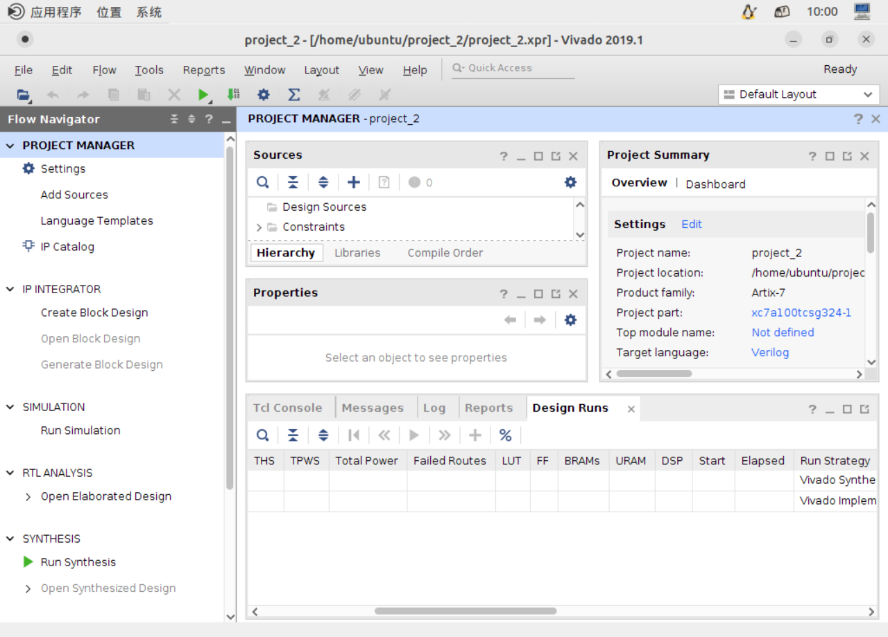

### 2. 新建设计文件

新建工程项目后，里面还没有我们的设计文件，接下来我们要为工程项目新建自己的设计文件。

在界面左侧可以找到 Add Sources，点击它：

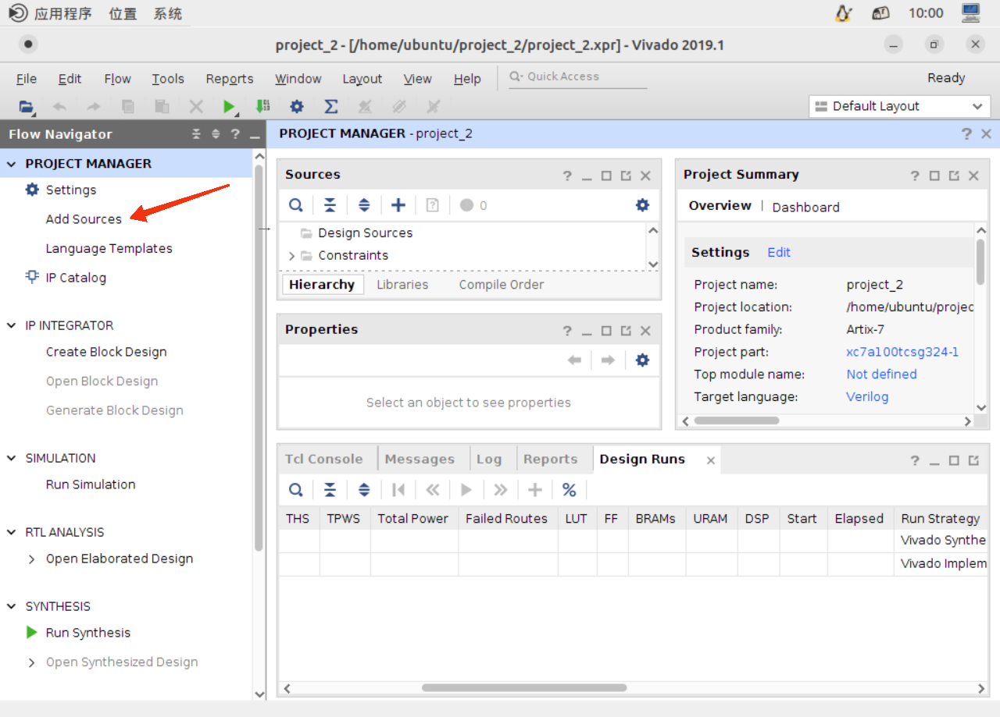

接下来我们开始新建设计文件，点击 Next，选择 Create File:

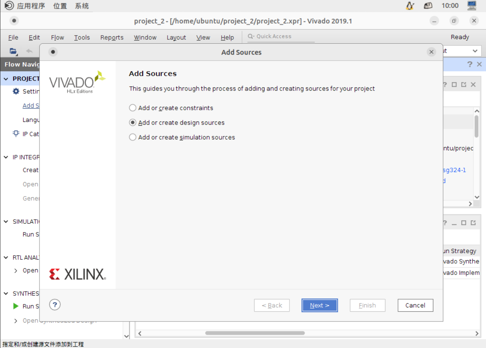


??? question "如何把别处的源代码加入此工程项目？"

    我们在开发时，可能有这种情况：其他位置已经写好了一份设计文件，可以用于此工程，如果在此工程中再新建一份此文件便浪费了时间和空间。我们可以按如下操作把别处的源代码加入此项目：

    在新建设计文件时，点击 Create File 左边的 **Add Files**，便可将其他位置已经写好的设计文件添加到此工程中。点击 **Add Directories** 可将别处的文件夹中所有设计文件加入此工程。

    需要注意的是，这里的“加入”，并不是把原来的设计文件复制一份加入此工程，而是直接加入。也就是说当你在此工程中对该设计文件进行修改时，如果该设计文件也被包含在其他工程中，那么其他工程中的这个设计文件也会被修改。

我们可以自行设置新建文件的名称：

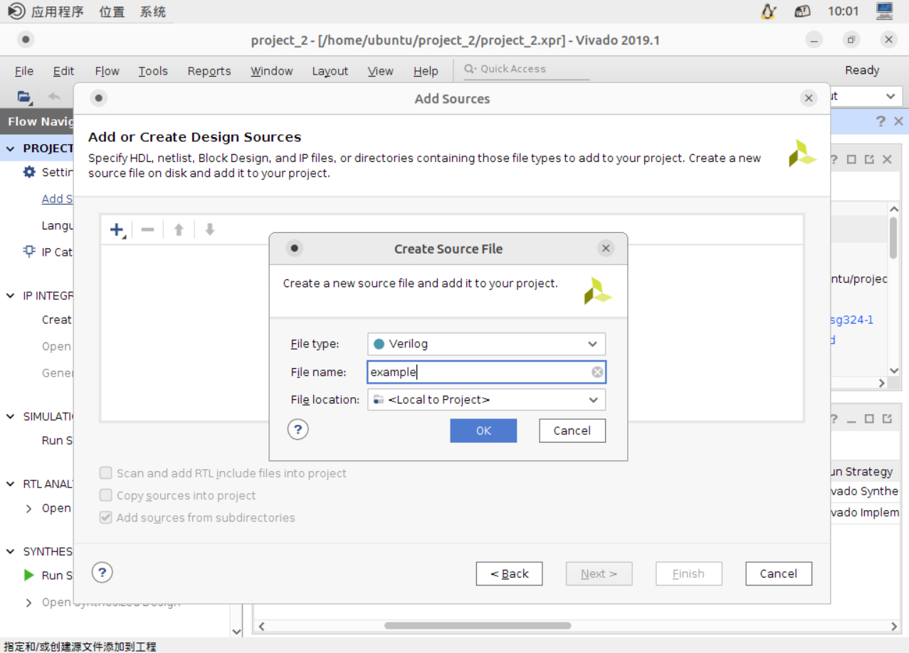

这样，我们就完成了设计文件的新建。双击文件就可以在编辑器中编辑它了。


## 本地安装并配置 VSCode {#installvs}

Visual Studio Code 是一款由微软开发的免费、轻量级且可扩展的代码编辑器。它适用于构建 Web、桌面和移动应用，并且支持多种编程语言和框架，具有丰富的扩展功能。下面介绍本地安装和配置 VSCode 的操作。

!!! info "注意"

    本文档主要用于**数字电路实验**教学，介绍了如何配置 VSCode 中 Verilog 相关环境。如需其他编程语言环境配置，请自行学习并操作。

### 1. 安装 VSCode

进入 VSCode 的[官方网站](https://code.visualstudio.com/)，点击 Download for Windows 下载。下载完成后打开可执行文件。在**选择附加任务**时建议全部勾选，特别是**添加到 PATH** 要勾选，否则后续还要自己将其添加到环境变量。

!!! info "注意"

    为了 VSCode 使用的稳定性，安装路径不要包含中文。下面要讲的 ctags 和 iverilog 同理，安装路径也要避免中文。

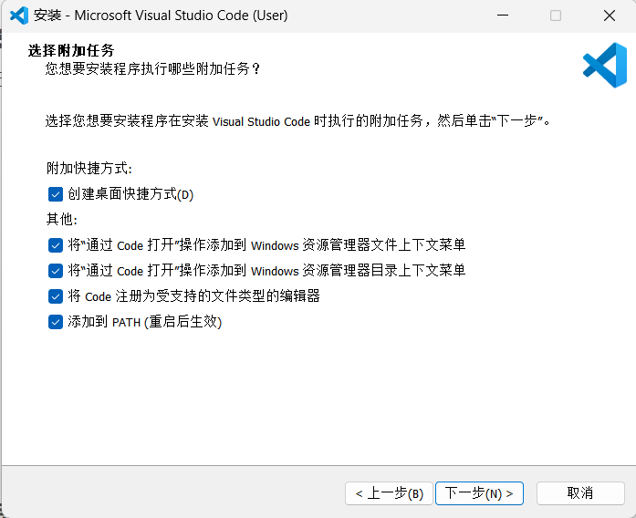

在我们完成了 VSCode 的安装后，第一次打开时界面是纯英文，看起来不是很方便。对此我们可以找到左侧的 **Extensions** 点开，搜索 Chinese，安装第一个“中文（简体）”然后重启 VSCode 即可汉化 VSCode。

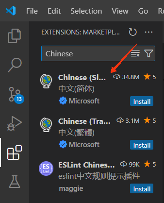

### 2. 安装 Verilog-HDL/SystemVerilog 插件

在汉化 VSCode 后，想必大家已经会在 VSCode 中搜索并安装插件了。对于 Verilog 的开发，我们需要安装 **Verilog-HDL/SystemVerilog** 插件。

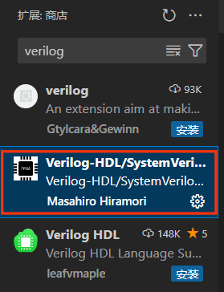

这个插件提供了 Verilog 开发的大多数基础功能，包括：

- 代码高亮
- 简单语法补全提示
- 静态语法检查（需要自行配置 linter）
- Ctags 功能集成（需要额外安装 ctags 组件）
  - 自动补全
  - 文档符号大纲
  - 鼠标悬停显示代码声明
  - Ctrl 鼠标点击跳转到代码声明

### 3. 安装 iverilog 和 ctags

目前我们已经安装了 Verilog-HDL/SystemVerilog 插件，但还需要安装 **iverilog**（一种 linter）和 **ctags**。

??? tip "关于 linter"

    **Linter** 是自动检查源代码中是否存在编程和样式错误的工具。对于 Verilog 的 linter 当然不止一种，本教程中使用的是 iverilog。除此之外还有 xvlog 和 Verilator，但 xvlog 来自于 Vivado，你需要在电脑本地安装 Vivado 才有 xvlog。而 Verilator 则是面向 Linux 平台开发的，截至目前使用官网方法在 Windows 平台上编译的 Verilator 都无法配合 VSCode 完成代码检查，需要在子系统 WSL 中安装并运行 Verilator，这里不再介绍具体步骤。

我们进入 iverilog 的[下载网站](https://bleyer.org/icarus/)，在 Download 中下载最新版本即可。安装时在 Select Components 界面全部勾选，然后勾选可执行文件所在文件夹加入用户路径。

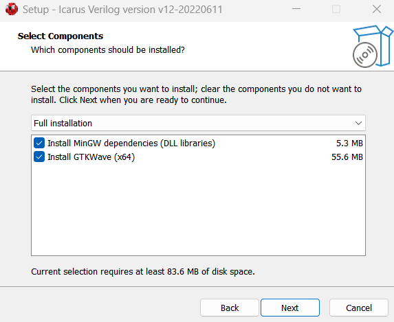

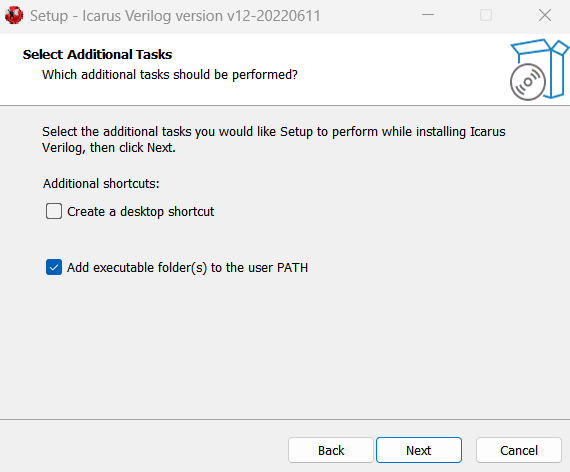

安装后将 iverilog.exe 和 gtkwave.exe 所在文件夹的路径复制加入用户环境变量。

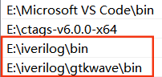

!!! question "如何添加环境变量"

    设置 -> 系统 -> 系统信息 -> 高级系统设置 -> 环境变量 -> 在上方的“用户变量”中找到 **Path** 一栏，双击进入，点击新建即可添加环境变量。

然后在命令行中输入以下命令检查 iverilog 是否安装成功：

```shell
iverilog -help
```

出现以下信息说明安装成功：

```text
Usage: iverilog [-EiSuvV] [-B base] [-c cmdfile|-f cmdfile]
                [-g1995|-g2001|-g2005|-g2005-sv|-g2009|-g2012] [-g<feature>]
                [-D macro[=defn]] [-I includedir] [-L moduledir]
                [-M [mode=]depfile] [-m module]
                [-N file] [-o filename] [-p flag=value]
                [-s topmodule] [-t target] [-T min|typ|max]
                [-W class] [-y dir] [-Y suf] [-l file] source_file(s)

See the man page for details.
```

再输入以下命令检查 gtkwave 是否安装成功：

```shell
gtkwave
```

弹出这个软件则配置成功。

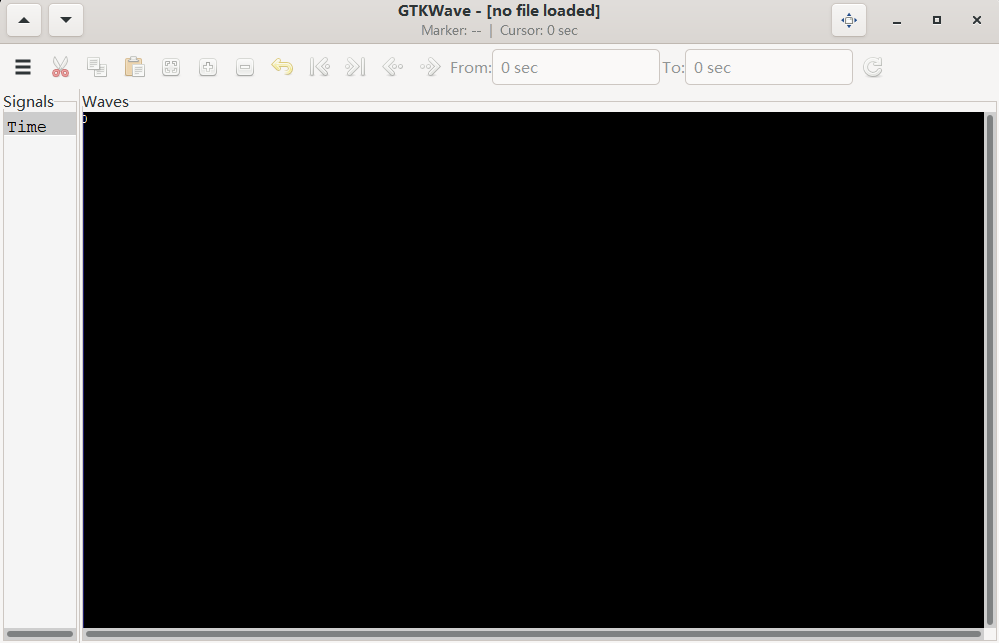

接下来我们进入[下载页面](https://github.com/universal-ctags/ctags-win32/releases)安装 **ctags**，可选择最新版本进入下载。


安装后同样将 ctags.exe 所在文件夹路径复制加入环境变量。

检查 ctags 是否安装成功：

```shell
ctags --version
```

显示的 ctags 信息是 universal ctags，说明安装正常。

### 4. 配置 Verilog-HDL/SystemVerilog 插件 {#config-extension}

在安装好 iverilog 和 ctags 后，我们要将其配置到到 Verilog-HDL/SystemVerilog 插件中。在已安装的插件中找到 Verilog-HDL/SystemVerilog，点击“管理”，打开“扩展设置”。

按下面的设置配置 ctags，将 linter 选择为 iverilog，并在 iverilog 的 Argument 一栏中加入 -i 参数。

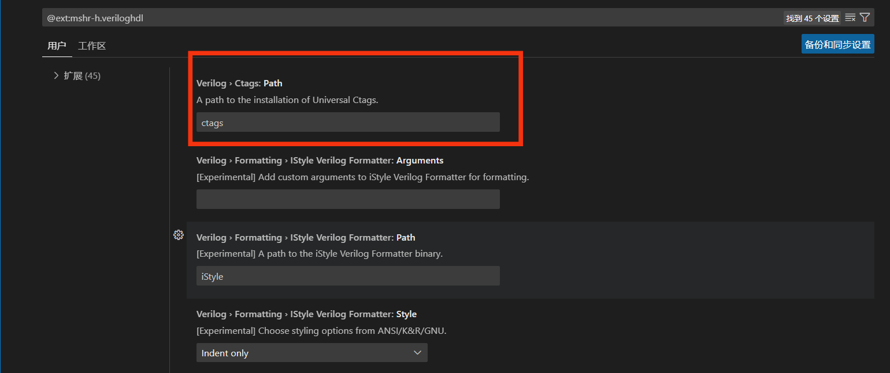

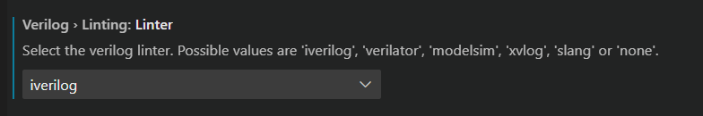

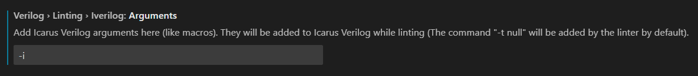

!!! tip "关于配置的说明"

    由于在安装 ctags 时已经将其加入到了环境变量，所以这里只需填入 ctags 即可。关于 `-i` 参数，是因为在实例化模块时 iverilog 会报错 "Unknown module type"，添加 `-i` 参数可以避免这种不合理的报错。

这样我们就可以在 VSCode 中进行 Verilog 的开发了！

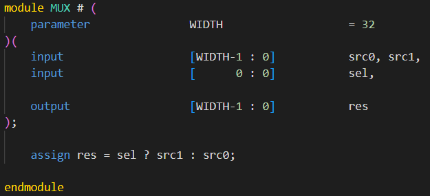

!!! info "提示"

    在用 VSCode 编写 Verilog 代码时，只有将文件保存后才会进行语法检查哦！

## 本地安装 SSH 环境 {#installssh}

在 Windows 系统中，OpenSSH 客户端和 OpenSSH 服务器是可单独安装的组件：OpenSSH 客户端可以使用 ssh 命令连接到其他支持 SSH 的设备，而 OpenSSH 服务器允许其他设备通过 SSH 连接到你的电脑。
Windows 用户应使用以下说明来安装和配置 OpenSSH。

在命令行中输入 `ssh`，若输出以下信息则已经安装，可跳过安装步骤。

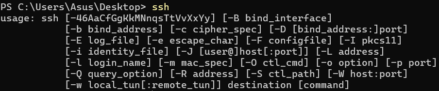

!!! info "Windows 10 和 Windows 11"
    Windows 10 和 Windows 11 版本的 OpenSSH 安装有所区别，请按对应的版本进行操作。

在安装时，
Windows 10 用户在 **设置 -> 应用 -> 应用和功能 -> 可选功能 -> 添加功能** 中搜索 **OpenSSH**;
Windows 11 用户在 **设置 -> 系统 -> 可选功能 -> 查看功能** 中搜索 **OpenSSH**，进行安装。

!!! tip "说明"

    我们只需安装 SSH 客户端便可远程连接虚拟机了，关于 SSH server 的配置这里不再细讲。如果要开启 SSH server 服务允许其他设备用 SSH 连接到你的电脑上，需要开启防火墙的 22 端口。

然后我们就可以开始通过 SSH 远程连接 Vlab 了！

## SSH 通过命令行远程连接 Vlab {#ssh2vlab}

### 1. SSH 连接 Vlab

我们以 Vlab 的 ubuntu 用户为例，打开本地命令行，输入命令：

```shell
ssh ubuntu@vlab.ustc.edu.cn
```

如果遇到 Warning，请输入 yes，然后根据提示输入 Vlab 平台的用户名和密码，即可登录虚拟机。

!!! question "用户名密码是什么？"

    `Vlab username` 是你的学号（或工号），在登录虚拟机管理页面后可以在右上角看到。

    `Vlab password` 是 Vlab 平台的登录密码。[还没设置？](web.md#change-password)

!!! question "关于 Vlab 的登录用户？"
    这里请参考**虚拟机登录 -> SSH 命令行登录**页面的[登录用户名](login/ssh.md#username)章节。

在断开与虚拟机的连接时输入 `exit` 即可。

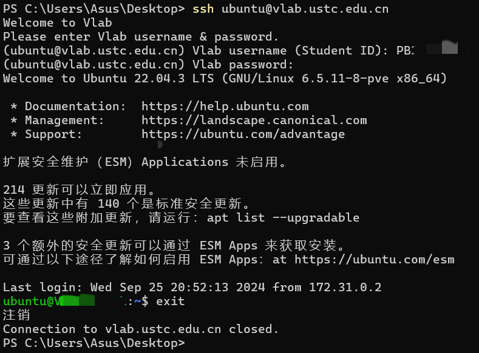

### 2. 使用公钥登录虚拟机

使用公钥登录虚拟机可以免除每次输入密码的麻烦，我们首先要生成密钥对并下载到本地。

这里下载密钥对的操作请参考**虚拟机登录 -> SSH 命令行登录**页面的[生成 SSH 密钥对并下载到本地](login/ssh.md#get-pubkey)章节。

我们将私钥放在 `%UserProfile%\.ssh` 目录中，例如 `%UserProfile%\.ssh\vlab.pem`。

!!! info "注意"

    本教程中该文件命名为 `vlab.pem`，如自行命名请在下面对应的步骤中修改相应配置。

!!! question "什么是 %UserProfile% "

    `%UserProfile%` 是用户目录，即 `C:\Users\用户名`。`vlab.pem` 文件的完整路径例如 `C:\Users\Asus\.ssh\vlab.pem`。

要确保只有你的账户有访问私钥文件的权限，否则可能出现 "Permissions are too open" 报错。具体操作如下：

右键单击 `.pem` 文件，进入**属性 -> 安全 -> 高级**，可以看到以下界面。


然后将所有者改为个人用户（如果已经是则不用改），并且删除掉其他用户的权限（如果这里因为继承权限无法删除，则要先点击"禁用继承"）。如果在权限条目中没有个人用户，则需手动添加：在点击"添加"后点击"选择主体"，然后指定对象类型为"用户"，点击"高级"，开始立即查找，便可找到个人用户。将其权限设置为"完全控制"，确定添加即可。

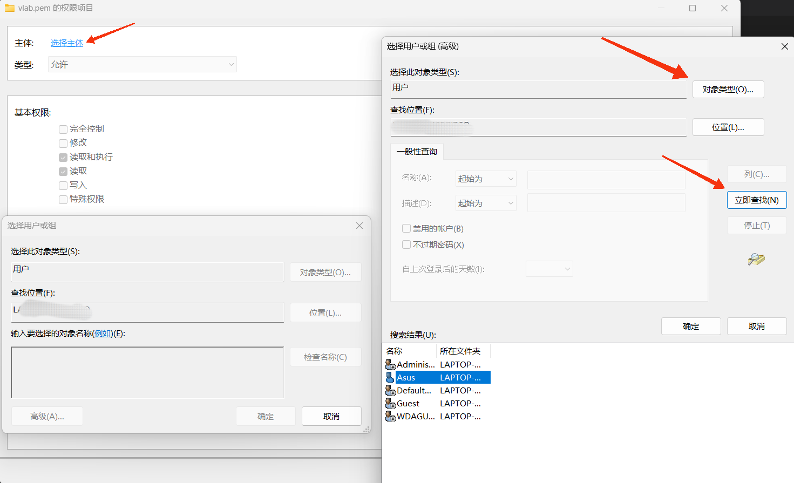

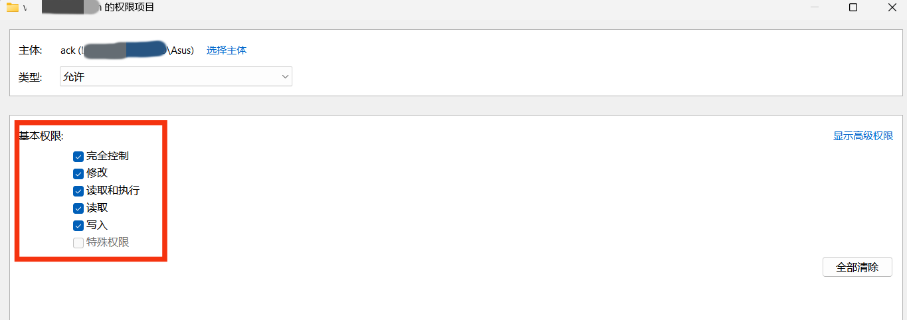

最后设置完毕如下：


修改权限后，可以在 CMD 或 PowerShell 中使用 ssh 命令登录：

```bat
ssh -i %UserProfile%\.ssh\vlab.pem ubuntu@vlab.ustc.edu.cn
```

这样我们通过 SSH 登录虚拟机就不用输入用户名和密码了。

### 3. 使用配置文件登录虚拟机

我们在 **C 盘个人用户**中的 **.ssh** 文件夹里新建文件 `config`（无后缀名），用记事本打开后输入以下内容：

```text
Host vlab
    HostName vlab.ustc.edu.cn
    User ubuntu
    IdentityFile %UserProfile%\.ssh\vlab.pem
```

!!! info "路径"
    如果你在上一步中按照教程放置 `.pem` 文件的位置，这里 `config` 文件应与其在同一个文件夹下。

此后我们在命令行中输入 `ssh vlab` 即可登录虚拟机，这样十分方便，而且支持了后面要讲的 VSCode 中使用 Remote SSH 功能。

## 本地 VSCode 通过 SSH 登录 Vlab {#vscode-ssh}

接下来我们在 VSCode 中通过 SSH 登录 Vlab。首先在 VSCode 中安装扩展 **Remote - SSH**。

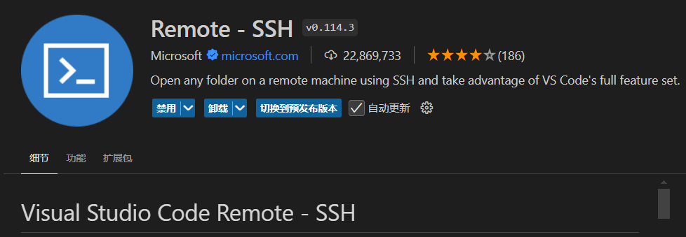

安装后在左侧会出现**远程资源管理器**。如果前面已经按照教程配置好了 SSH，可以看到我们的虚拟机 Vlab。

!!! info "注意"
    若还未配置好 SSH 请按照上面的教程进行 SSH 配置，实现公钥登录并完成配置文件。

点击 **vlab** 右侧的图标，在现有的窗口/新窗口中连接 Vlab。在选择远程平台时选择 **Linux**。

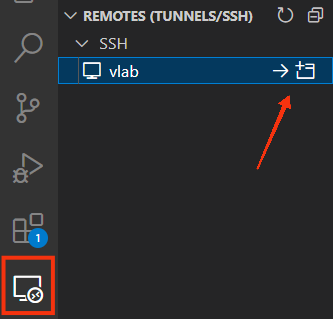

首次连接时会显示“正在下载 VSCode 服务器”。这是正在 Vlab 虚拟机上安装 VSCode 服务器，时间可能比较长，请耐心等待。

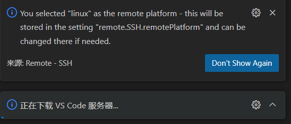

下载好后，左下角显示 **SSH:vlab** 即连接成功。


在上方的**文件->打开文件夹**即可选择要打开的 Vlab 上的文件夹，新建文件同理。

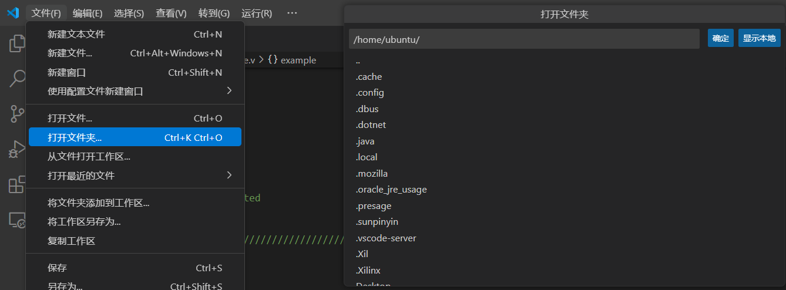

我们也可以用快捷键 **Ctrl + \`** 打开终端，此时的终端环境是 Vlab 的，可以通过命令行对 Vlab 进行操作。

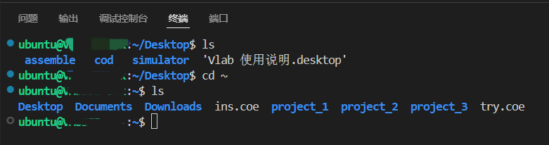

## 本地 VSCode 编辑 Vlab 的 Verilog 项目 {#Vlab-verilog}

截至目前，我们已经能用本地 VSCode 远程编辑 Vlab 上的文件了。但当我们用 VSCode 打开 Vlab 中新建的 `.v` 文件时，却发现没有了语法高亮。这是因为 Verilog-HDL/SystemVerilog 扩展被定义为在远程扩展主机中运行，故在此工作区中被禁用。我们需要在本地已安装的扩展中找到 Verilog-HDL/SystemVerilog，点击**在 SSH:vlab 中安装**，来启用该扩展。

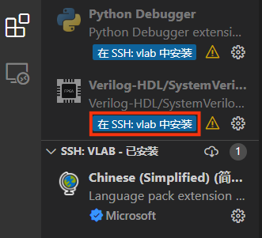

然后我们的 Verilog 代码就有了语法高亮。但当我们编写代码时，会发现前面配置好的 ctags 和 iverilog 失效了：鼠标悬停不显示代码声明，“CTRL 鼠标点击跳转到代码声明”的功能失效，代码的语法错误也不会报错。

!!! question "为什么？"
    这是因为此时的 Verilog-HDL/SystemVerilog 插件使用的是 Vlab 中安装的，所以需要对 SSH:vlab 中的该插件进行同本地的配置。

我们要在 Vlab 中安装 ctags 和 iverilog（和 gtkwave）。在 **Vlab 虚拟机** 中打开终端，执行以下命令：

```shell
sudo apt update
sudo apt install iverilog gtkwave universal-ctags
```

然后在 VSCode 已打开的远程连接 Vlab 中打开 Verilog-HDL/SystemVerilog 的扩展设置，将**远程 [SSH:vlab]**和**工作区**中同[本地配置](#config-extension)（即“用户”一栏中的配置）进行设置。

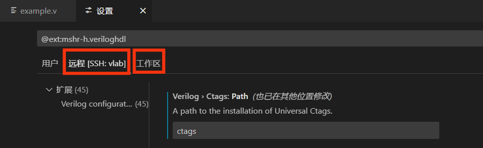

完成后，我们就可以在本地 VSCode 对 Vlab 中的 Vivado 设计文件进行编辑了！

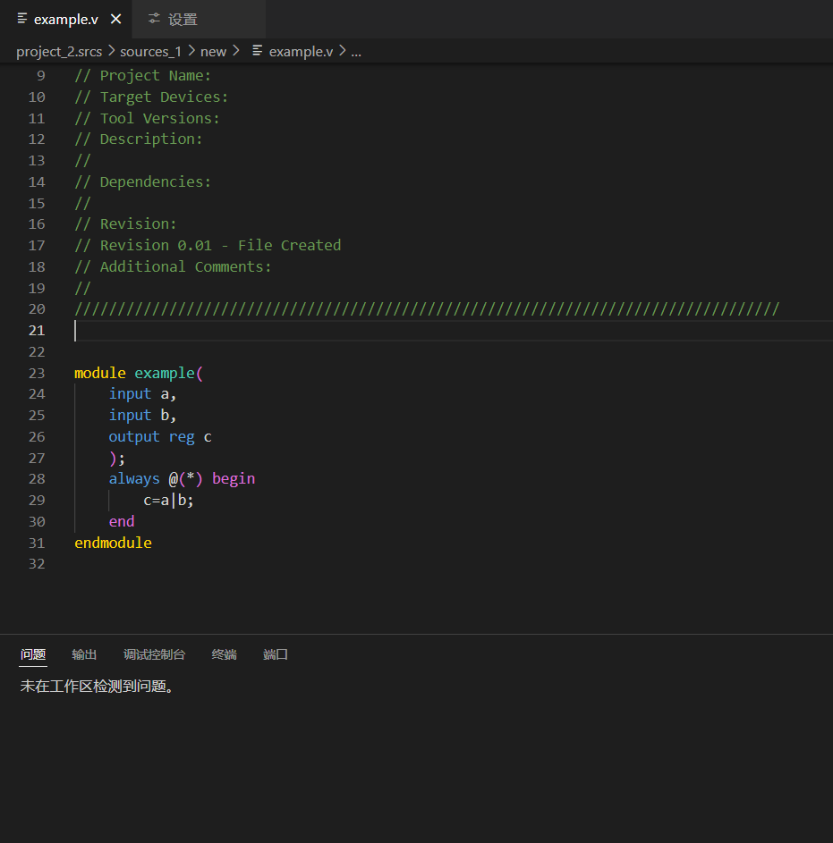
