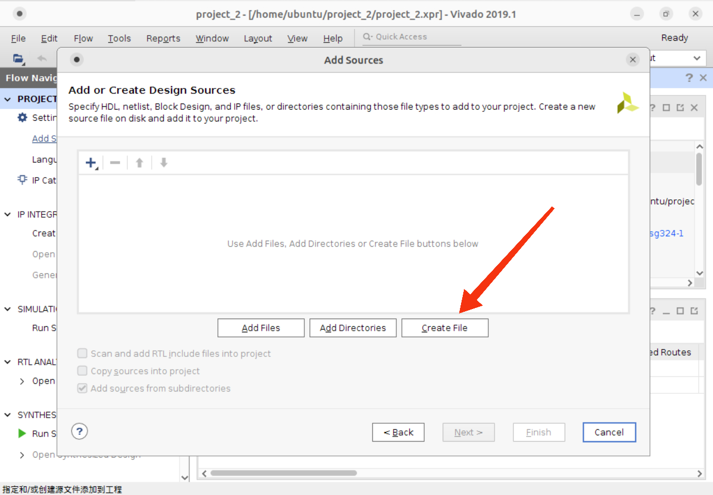
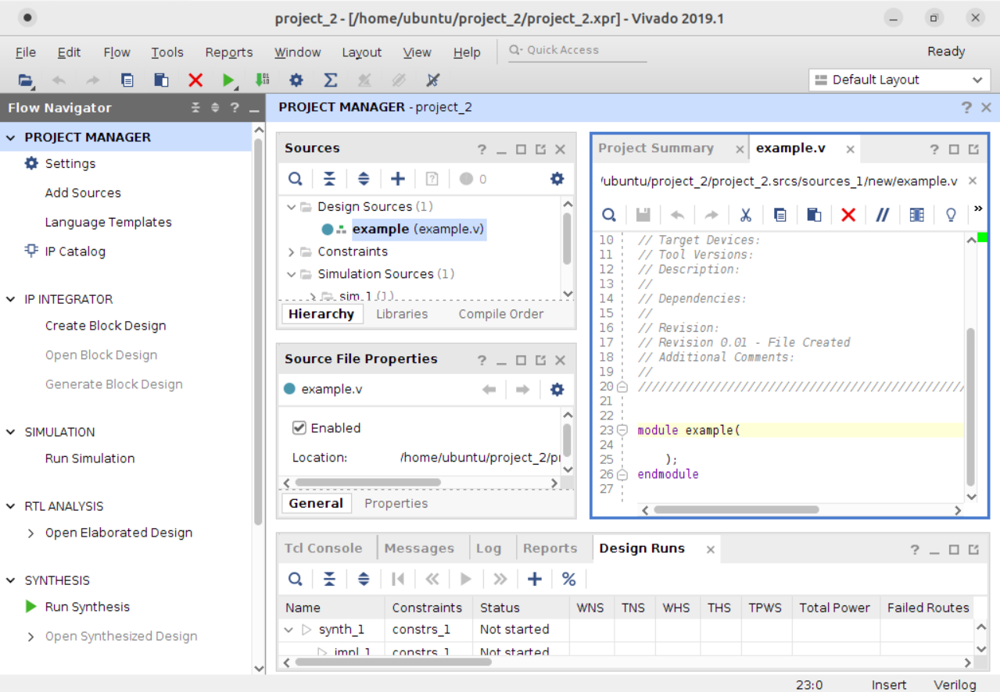
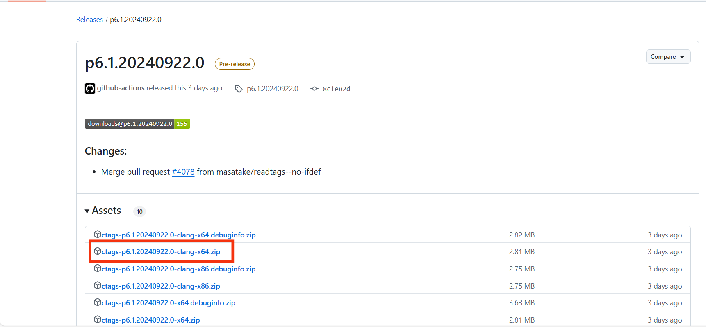
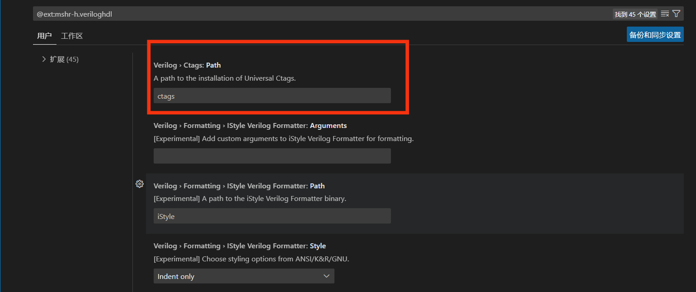

# 本地 VSCode 通过 Remote SSH 连接 Vlab

## 虚拟机 Vivado 新建工程和设计文件 {#vivado}


### 1. 新建工程

在虚拟机的桌面上，最上面**应用程序**中的**Vlab实验软件**里可找到预先安装的的 Vivado，点击进入 Vivado。这里请大家选择 2019.1 版本，不要选择 2016.3 的旧版本。2023.1 版本的 Vivado 虽然更便捷，但可能引起内存不足的警告，因此请大家酌情使用。


进入 Vivado 后，点击 ***Create Project***:


然后点击 ***Next***:


在这个界面，你可以设置工程文件的名称和路径:


随后一路 ***Next***，直到遇到“选择开发板型号”的界面。按照如下配置可以搜到我们使用的开发板，点击选择最下面的开发板。

!!! info "注意"

    此型号是按照往年课程使用的开发板选择的。
    
    若课程安排有所调整，请以实际课程要求开发板型号为准。


完成后，我们就成功新建了一个工程项目，可以看到如下界面:


### 2. 新建设计文件

新建工程项目后，里面还没有我们的设计文件，接下来我们要为工程项目新建自己的设计文件。

在界面左侧可以找到 ***Add Sources***，点击它:


接下来我们开始新建设计文件，点击 ***Next***，选择 ***Create File***:




??? question "如何把别处的源代码加入此工程项目？"

    我们在开发时，可能有这种情况：其他位置已经写好了一份设计文件，可以用于此工程，如果在此工程中再新建一份此文件便浪费了时间和空间。我们可以按如下操作把别处的源代码加入此项目：

    在新建设计文件时，点击 ***Create File*** 左边的 ***Add Files***，便可将其他位置已经写好的设计文件添加到此工程中。点击 ***Add Directories*** 可将别处的文件夹中所有设计文件加入此工程。

    需要注意的是，这里的“加入”，并不是把原来的设计文件复制一份加入此工程，而是直接加入。也就是说当你在此工程中对该设计文件进行修改时，如果该设计文件也被包含在其他工程中，那么其他工程中的这个设计文件也会被修改。

我们可以自行设置新建文件的名称:


这样，我们就完成了设计文件的新建。双击文件就可以在编辑器中编辑它了。



## 本地安装并配置 VSCode {#installvs}

Visual Studio Code 是一款由微软开发的免费、轻量级且可扩展的代码编辑器。它适用于构建 Web、桌面和移动应用，并且支持多种编程语言和框架，具有丰富的扩展功能。下面介绍本地安装和配置 **VSCode** 的操作。

!!! info "注意"

    本文档主要用于**数字电路实验**教学，介绍了如何配置 VSCode 中 **Verilog** 相关环境。如需其他编程语言环境配置，请自行学习并操作。

### 1. 安装 VSCode

进入 VSCode 的[官方网站](https://code.visualstudio.com/)，点击 **Download for Windows** 下载。下载完成后打开可执行文件。在**选择附加任务**时建议全部勾选，特别是***添加到 PATH ***要勾选，否则后续还要自己将其添加到环境变量。

!!! info "注意"

    为了 VSCode 使用的稳定性，安装路径不要包含中文。下面要讲的 **ctags** 和 **iverilog** 同理，安装路径也要避免中文。


在我们完成了 VSCode 的安装后，第一次打开时界面是纯英文，看起来不是很方便。对此我们可以找到左侧的 **Extensions** 点开，搜索 "Chinese"，安装第一个 “中文(简体)” 然后重启 VSCode 即可汉化 VSCode。


### 2. 安装 Verilog-HDL/SystemVerilog 插件

在汉化 VSCode 后，想必大家已经会在 VSCode 中搜索并安装插件了。对于 Verilog 的开发，我们需要安装 **Verilog-HDL/SystemVerilog** 插件。


这个插件提供了 Verilog 开发的大多数基础功能，包括:

- 代码高亮
- 简单语法补全提示
- 静态语法检查(**需要自行配置linter**)
- Ctags功能集成(**需要额外安装ctags组件**)
    - 自动补全
    - 文档符号大纲
    - 鼠标悬停显示代码声明
    - CTRL鼠标点击跳转到代码声明

### 3. 安装 iverilog 和 ctags

目前我们已经安装了 Verilog-HDL/SystemVerilog 插件，但还需要安装 **iverilog(一种linter)** 和 **ctags**。

??? tip "linter"

    对于 verilog 的 linter 当然不止一种，本教程中使用的是 iverilog。除此之外还有 ***xvlog*** 和 ***Verilator***，但 xvlog 来自于 ***vivado***，你需要在电脑本地安装 vivado 才有 xvlog。而 Verilator 则是面向 linux 平台开发的，截至目前使用官网方法在 Windows 平台上编译的 Verilator 都无法配合 VSCode 完成代码检查，需要在子系统 ***WSL*** 中安装并运行 Verilator，这里不再介绍具体步骤。

我们进入 iverilog 的[下载网站](https://bleyer.org/icarus/)，在 Download 中下载最新版本即可。安装时在 Select Components 界面全部勾选，然后勾选可执行文件所在文件夹加入用户路径。


安装后将 iverilog.exe 和 gtkwave.exe 所在文件夹的路径复制加入用户环境变量。


!!! question "如何添加环境变量"

    设置->系统->高级系统设置->环境变量->在上方的“用户变量”中找到 **Path** 一栏，双击进入，点击新建即可添加环境变量。

然后在命令行中输入以下命令检查 iverilog 是否安装成功:

```shell
iverilog -help
```
出现以下信息说明安装成功:

```
Usage: iverilog [-EiSuvV] [-B base] [-c cmdfile|-f cmdfile]
                [-g1995|-g2001|-g2005|-g2005-sv|-g2009|-g2012] [-g<feature>]
                [-D macro[=defn]] [-I includedir] [-L moduledir]
                [-M [mode=]depfile] [-m module]
                [-N file] [-o filename] [-p flag=value]
                [-s topmodule] [-t target] [-T min|typ|max]
                [-W class] [-y dir] [-Y suf] [-l file] source_file(s)

See the man page for details.
```
再检查 gtkwave 是否安装成功:

```shell
gtkwave
```

弹出这个软件则配置成功。


接下来我们进入[下载页面](https://github.com/universal-ctags/ctags-win32/releases)安装 **ctags**，可选择最新版本进入下载。



安装后同样将 ctags.exe 所在文件夹路径复制加入环境变量。

检查 ctags 是否安装成功:

```shell
ctags --version
```

显示的ctags信息是universal ctags，说明安装正常。

### 4. 配置 Verilog-HDL/SystemVerilog 插件

在安装好 iverilog 和 ctags 后，我们要将其配置到到 Verilog-HDL/SystemVerilog 插件中。在已安装的插件中找到 Verilog-HDL/SystemVerilog，点击“管理”，打开“扩展设置”。

按下面的设置配置 ctags，将 linter 选择为 iverilog，并在 Iverilog 的 Argument 一栏中加入 -i 参数。




!!! tip "关于配置的说明"

    由于在安装 ctags 时已经将其加入到了环境变量，所以这里只需填入 ctags 即可。关于 -i 参数，是因为在实例化模块时 iverilog 会报错 "Unknown module type"，添加 "-i" 参数可以避免这种不合理的报错。

这样我们就可以在 vscode 中进行 verilog 的开发了！


!!! tip "提示"
    在用 VSCode 编写 Verilog 代码时，只有将文件保存后才会进行语法检查哦！

## 本地安装 SSH 环境 {#installssh}

## 本地 SSH 远程连接 Vlab {#ssh2vlab}

## 本地 VSCode 和 SSH 环境是否需要关联 {#vscode-ssh}

## VSCode 是否需要指定具体访问 Vlab 哪个文件夹 {#vscode-vlabfile}

