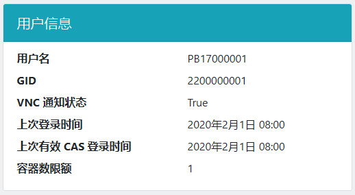

# 虚拟机管理控制台

虚拟机管理控制台是你管理虚拟机的地方。在这里你可以创建虚拟机、开关机和重启，以及查看远程连接信息。

## 登录 {#login}

在登录界面，可以使用你的学号登录，或者通过统一身份认证使用**学号**登录。

## 界面 {#interface}

登录后，你可以查看你账号下拥有的虚拟机。默认每个用户允许创建 1 个虚拟机。

### 设置登录密码 {#change-password}

虚拟机管理页面的右上角提供设置密码、退出登录与查看用户信息的功能，如图：

{: .img-border }

通过此处设置的密码既用于登录平台管理页面（不使用统一身份认证的时候），也用于通过 VNC 和 SSH 方式登录虚拟机。

### 创建虚拟机 {#create-vm}

点击「新虚拟机」按钮，可以创建虚拟机。在创建页面中，需要输入虚拟机名称并选择镜像。

其中：

- 虚拟机名称只能由英文字母、数字、短线 (`-`) 和点 (`.`) 构成
- 镜像选择中，只有含 `desktop` 的镜像包含桌面环境；不含 `desktop` 的镜像只能使用命令行登录，建议有 Linux 经验的同学选用

    !!! question "不知道选择哪个镜像？"

        你可以参考[《虚拟机镜像》一页](advanced/images.md)。

        对于大多数计算机系同学，我们推荐使用默认镜像（名称以 `vlab01` 开头）。

    ??? question "root 密码是什么？"

        在 Linux 系统中，root 是“超级用户”，拥有系统中的所有权限。root 密码即可理解为“超级管理员密码”。

        该密码仅在虚拟机中有效，适用于虚拟机内的 `su` 命令。SSH 和 VNC 登录使用平台的登录密码，SSH 也可以使用公钥登录。

点击「创建」创建虚拟机，稍等片刻即可。

### 管理虚拟机 {#manage-vm}

下方的功能按钮分别为：

- 开机：启动虚拟机（如果虚拟机处于关闭状态）
- 关机：停止虚拟机运行
- 重启：重启虚拟机（请注意在停止/重启前保存你的状态）
- 桌面连接：跳转至浏览器 VNC 登录页面，见[浏览器登录](login/browser.md)页面。
- 更改 root 密码：如其所述
- 销毁：删除这个虚拟机。**注意这是不可逆的，所有数据都会被删除。**

!!! info "提示"

    「桌面连接」和「更改 root 密码」这两个按钮只在虚拟机开机时才会出现。

### 查看用户信息 {#userinfo}

点击虚拟机管理页面右上角的用户名（学工号），可以查看当前登录用户的信息。

其中“有效 CAS 登录时间”是我们判断用户在校状态的重要依据。CAS 即[科大统一身份认证服务](https://passport.ustc.edu.cn/login)。

!!! tip "有效 CAS 登录"

    当你从登录界面通过统一身份认证登录时，我们会从统一身份认证平台获取你的在校状态信息。如果你的在校状态为“在校”，那么此次登录会被记录为“有效的 CAS 登录”。

## 使用 SSH/VNC 登录虚拟机 {#login-vm}

使用统一身份认证登录的用户，初始密码为空，因此无法使用 VNC 登录，需要[设置平台登录密码](#change-password)后方可使用 VNC 登录虚拟机。

VNC 登录方式的具体操作请在左侧目录查阅各个操作系统的配置说明。

!!! info "提示"

    SSH 方式的登录用户为 root / ubuntu / vlab，具体请参见[虚拟机镜像](advanced/images.md)。

    VNC 登录使用 Vlab 专有的服务，使用学号或工号与上面所述的平台密码登录。
